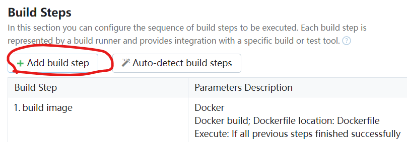

[toc]

# 1 TeamCity介绍
TeamCity是由JetBrains开发的一款用于持续集成（CI）和持续交付（CD）的构建管理和发布系统。它帮助开发团队自动化构建、测试和部署流程，从而提高软件开发效率和质量。

### TeamCity的主要特点：

1. **持续集成**：
   - TeamCity可以自动从版本控制系统中拉取代码，运行构建和测试，并在代码发生变化时立即反馈构建结果。
   - 支持多种版本控制系统，包括Git、SVN、Mercurial、Perforce等。

2. **持续交付**：
   - 它可以配置复杂的构建管道，自动化从代码提交到生产环境的整个过程。
   - 支持部署到各种环境，如云服务（AWS, Azure）、容器（Docker, Kubernetes）等。

3. **并行构建**：
   - TeamCity允许并行运行多个构建任务，可以显著加快构建速度。

4. **可视化和反馈**：
   - 提供详细的构建日志和历史记录，方便追踪和分析构建问题。
   - 可以通过电子邮件、IM、浏览器通知等多种方式提供构建反馈。

5. **插件支持**：
   - TeamCity有丰富的插件生态系统，可以通过插件扩展其功能。
   - 可以与JIRA、Trello等项目管理工具集成，提升团队协作效率。

6. **配置灵活**：
   - 支持配置模板和参数化构建，可以根据项目需要灵活调整构建配置。
   - 可以使用Kotlin DSL进行代码化配置，使得复杂的构建配置更加可维护。

7. **安全性**：
   - 提供用户角色和权限管理，确保构建过程的安全性。
   - 支持集成LDAP和OAuth等认证方式。

### TeamCity的工作流程：

1. **代码提交**：开发人员将代码提交到版本控制系统。
2. **触发构建**：TeamCity监控到代码库的变化，自动触发构建。
3. **运行构建和测试**：TeamCity拉取最新代码，执行预定义的构建和测试步骤。
4. **反馈结果**：构建和测试结果通过日志、报告和通知等形式反馈给开发人员。
5. **部署**：如果构建和测试通过，TeamCity可以自动部署应用到指定的环境。

### 为什么使用TeamCity：

- **提高开发效率**：通过自动化构建和测试流程，减少人为干预和错误，提高开发效率。
- **早期发现问题**：持续集成可以在代码提交后立即发现问题，减少代码集成的风险。
- **优化发布流程**：持续交付自动化发布流程，减少手动操作，提高发布的可靠性和一致性。
- **团队协作**：通过集成项目管理和反馈工具，提升团队协作效率。

总之，TeamCity是一款功能强大、配置灵活的持续集成和持续交付工具，可以显著提升软件开发和发布的效率与质量。

# 2 安装TeamCity
下载TeamCity: https://www.jetbrains.com.cn/teamcity/ 选择TeamCity Professional, 这个官网承诺是永久免费


## 2.1 Windows安装TeamCity


# 3 doker中启动TeamCity

## 3.1 拉取镜像
对应的版本可以在https://hub.docker.com/r/jetbrains/teamcity-server/tags上查看

```shell
# 拉取最新的teamcity镜像
docker pull jetbrains/teamcity-server

# 拉取指定的TeamCity镜像
docker pull jetbrains/teamcity-server:2023.05.6
```

编写TeamCity的dockerfile的规则：
https://hub.docker.com/r/jetbrains/teamcity-server
```dockerfaile
docker run --name teamcity-server-instance
    -v <path-to-data-directory>:C:/ProgramData/JetBrains/TeamCity
    -v <path-to-logs-directory>:C:/TeamCity/logs
    -v <path-to-temp-directory>:C:/TeamCity/temp
    -p <port-on-host>:8111
    jetbrains/teamcity-server
```

# 4 使用TeamCity
## 4.1 Windows下使用
- 在安装好TeamCity后会提示你配置


- 配置好后会提示你，配置文件存储的位置


- 在浏览器第一次访问TeamCity时会提示你配置数据库，这里我们选择的是内置的数据库。


选择好后会进行初始化

- 之后会让我们创建一个登录的账号密码
jake--zxcvbnm1997


## 4.2 创建新的项目
1. 点击Create project


2. 选择代码仓库地址，并提供登录的账号的密码，以便于自动拉取代码


**注意**: github目前不能使用账号密码登录，可以使用token, 在github的 Setting --> Developer setting --> Personal access tokens中生成token来代替密码

3. 设置要用于编译的分支


4. 确认后会对代码做一些检测，看是用什么来运行，例如docker等


确定后进入下一步，用于构建运行项目的流水线。这里为我们创建了第一步 docker


5. 点击第一步进入 第一步的编辑界面, 编辑打包为镜像的选项


- **Path to file**: 选择仓库项目中用于Dockerfile的文件名称，
- **Image platform**：现在镜像的平台
- **Image name:tag*： 打包为镜像后的容器名和标签

6. 构建好容器后接下来是运行容器，因此点击 **Add build step** 添加下一步




7. 选择command Line （命令行）


8. 步骤编辑好后点击左上角


