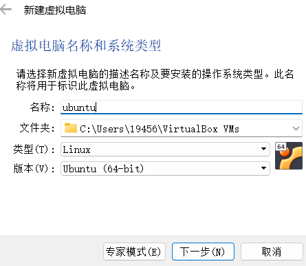
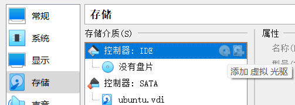

[toc]
# 1 linux中文输入法安装
引言
在Ubuntu系统中，无论是写文档还是在程序中写注释，都经常需要用到中文输入法。本文简单介绍了三种输入法框架，然后详细介绍了在Ubuntu 20.04系统中，IBus框架和Fcitx框架支持的中文输入法的配置和安装。

一、添加中文语言支持
在安装中文输入法之前，首选要添加中文语言支持。

1、单击Ubuntu桌面右上角的三角符号，然后选择“Settings”，打开系统设置页面。

2、在系统设置页面左侧的导航栏中选择“Region&Language”，然后在右侧页面中点击“Manage Install Languages”。

3、如果弹出下面这个窗口，单击窗口中的 Install，然后等待安装完毕。

4、单击“Install/Remove Languages”。

5、勾选Chinese(simplified)，然后单击Apply，开始装简体中文。

6、耐心等待安装完毕。

7、安装完毕后，单击Close。

8、重启系统。

二、输入法框架
在安装中文输入法之前，还要先安装或选择支持这种输入法的输入法框架。

在Linux系统上，常见的输入法框架（Keyboard input method system）有三种：IBus（Intelligent Input Bus）、Fcitx（FlexibleInput Method Framework）、XIM（X Input Method）。在Ubuntu20.04系统中，默认已经安装了IBus和XIM这两种输入法框架，Fcitx需要自己安装。

如下所示，每种输入法框架下，都有其支持的中文输入法（有些是框架自带的，有些需要另外安装）：

Fcitx：谷歌拼音、搜狗拼音、搜狗五笔拼音
IBus：智能拼音，五笔（86版）
XIM：略(现在用的相对比较少)
如何选择已安装的输入法框架？
 进入本文第一部分的第4步中的窗口，窗口中的最后一项就是输入法框架，选择后关闭窗口，重启系统。

三、添加IBus的中文输入法
1、重新进入本文第一部分第2步所示页面，单击+号。

2、双击Chinese。

3、可以看到有多种IBus中文输入法可选，选择中文输入法，比如：智能拼音Chinese(Intelligent Pinyin)，然后单击Add。可以反复添加多种中文输入法。

4、如果需要，可以单击输入法右边的设置按钮，对输入法的特性进行设置。单击右上角的叉号关闭系统设置页面。至此，已完成智能拼音输入法的安装。

5、在Ubuntu桌面的右上角可以看到并切换输入法，或者按“Win+空格”键切换。

四、安装Fcitx的中文输入法
1、首先再终端中执行fcitx --version ，检测是否已经安装fcitx框架。

2、安装fcitx框架

sudo apt-get update
sudo apt-get install fcitx-bin
复制
如果安装不成功，可以先把Ubuntu使用的软件源换成国内的，比如：阿里源、清华源等。

安装完成后，可以在Ubuntu桌面的右上角看到一个键盘图标，如下图所示：

sudo apt-get install fcitx-table 
sudo apt-get install fcitx-table-all
复制
安装fcitx-table时，会自动安装拼音输入法fcitx-pinyin，如下图所示：

安装fcitx-table-all时，除了会自动安装fcitx-table和fcitx-pinyin之外，还会安装其他的一些输入法，比如：五笔、五笔拼音等等。本文没有安装fcitx-table-all。

安装完成后，你会发现在本文第一部分的第4步所示的窗口中出现了输入法框架fcitx：

选择输入法框架fcitx，然后单击Close，重启系统。单击Ubuntu右上角的小键盘图标，在下拉菜单里选择Configure Current Input Method，可以看到已经安装的两个拼音输入法：

打开一个终端或者文本编辑器，按“CTRL+空格”键，在中文/英文输入法之间切换；按“CTRL+SHIFT”键，在fcitx框架中的多种中文输入法之间切换。

3、安装fcitx框架支持的其他中文输入法，比如：谷歌拼音输入法。

sudo apt-get install fcitx-googlepinyin
复制

安装完成后，单击Ubuntu右上角的小键盘图标，在下拉菜单里选择Configure Current Input Method，可以看到已经安装的谷歌拼音拼音输入法：

版权声明：本文内容由互联网用户自发贡献，该文观点仅代表作者本人。本站仅提供信息存储空间服务，不拥有所有权，不承担相关法律责任。如发现本站有涉嫌侵权/违法违规的内容， 请发送邮件至 举报，一经查实，本站将立刻删除。 

# Oracle VirtualBox6.1安装ios镜像

1. 点击新建，如下图进行选择

2. 配置内存8G

3. 点击下一步，选择现在创建虚拟硬盘
4. 选择创建虚拟磁盘大小后，下一步，下一步。知道虚拟机创建完成
5. 在设置中添加ios镜像的路径：
点击选中的蓝色中  左边的加号选择ios镜像。

根据提示往下走就好了。