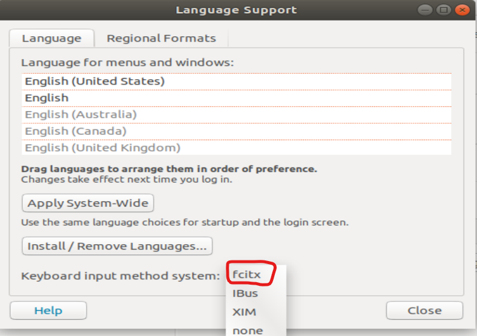
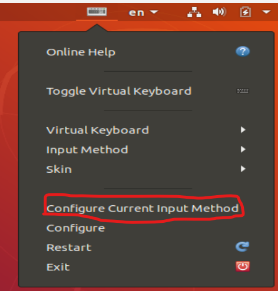
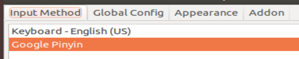
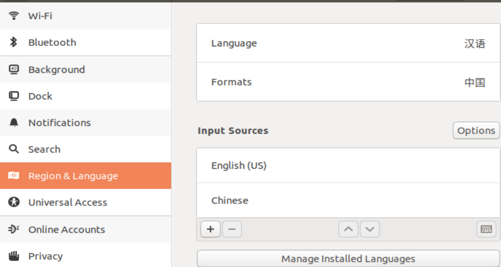

[toc]
# 1 安装的环境
## 1.1 git环境
```shell
# ssh-keygen -t rsa -C "your_emial@examle.com" 生成ssh公钥
sudo apt-get install ssh

# git config --global user.name jake
# git config --glocal user.email "1945656328@qq.com"
sudo apt-get install git
```

## 1.2 编码环境
```shell
sudo apt-get install gcc
sudo apt-get install make
sudo apt-get install cmake
sudo apt-get install g++
sudo apt-get install vim
```

## 1.3 中文输入法
```shell
sudo apt-get install fcitx-bin
sudo apt-get install fcitx-table
sudo apt-get install fcitx-googlepinyin
```
安装后在设置-->Region & Language-->Manage Installed Language 选择fcitx

重启后，在右上角的键盘图标点击-->选择Configure Current Input Method. 选择Google Pinyin. 之后就可以ctr+空格来切换中英文输入了。



## 1.4 redis环境
```shell
# 下载redis源码
wget http://download.redis.io/releases/redis-5.0.0.tar.gz

#解压
tar -xvf redis-5.0.0.tar.gz

# 进入目录中编译
make

# 安装
sudo make install
```

## 1.6 压缩/解压工具
```shell
# zip工具
sudo apt-get install zip
```

## 1.7 openGLES环境
```shell
# png图片解析
sudo apt-get install libpng-dev
sudo apt-get install libsoil-dev libglm-dev libassimp-dev libglew-dev libglfw3-dev libxinerama-dev libxcursor-dev libxi-dev libgles2-mesa-dev libtinyxml2-dev
# 安装字体解析库
sudo apt install libfreetype6-dev
```

## 1.8 Qt环境
Ubuntu18.04（qt5.15.2要求最少也得在18.04以上）
0. 配置依赖环境
sudo apt-get install gcc gedit flex bison gperf libxcb* build-essential libgl1-mesa-dev libglu1-mesa-dev libegl1-mesa-dev freeglut3-dev libxkbcommon-x11-dev libxkbcommon-dev libxrender-dev libx11-dev libx11-xcb-dev
1. [下载Qt5.9.2](https://download.qt.io/archive/qt/ "https://download.qt.io/archive/qt/")
2. 解压，进入目录
```shell
# 执行后第一个选o,第二个选项选y
# 安装到/usr/bin下
./configure -prefix $PWD/qtbase -opensource

# 编译
make -j 8

sudo make install

#配置环境变量
#1.打开配置文件：
sudo gedit /etc/profile
#2.文件末尾添加内容如下：
export QTDIR=/usr/local/bin/Qt
export PATH=QTDIR/bin:PATH
export MANPATH=QTDIR/man:MANPATH
export LD_LIBRARY_PATH=QTDIR/lib:LD_LIBRARY_PATH
export QT_SELECT=qt-5.9.2
```

# 2 配置ubuntu虚拟机遇到的问题
## 2.1 打不开终端
现象： 右键选择open terminate打不开终端
解决之法：在设置中的Region & Language中将language和format分别改为汉语和中国。然后选择restart


## 2.2 粘贴板不共享
1. 确保已经安装了 VirtualBox Guest Additions。Guest Additions 提供了许多增强功能，包括共享粘贴板。
2. 打开虚拟机，然后在 VirtualBox 的菜单中选择“Devices”->“Insert Guest Additions CD image”。
3. 在 Ubuntu 虚拟机中，打开终端并运行以下命令以安装 Guest Additions：
```shell
sudo apt update
sudo apt install build-essential dkms linux-headers-$(uname -r)

# 如果每个/dev/cdrom这个文件可以直接到/media下去看看有没有挂载文件，看里面是否有VBoxLinuxAdditions.run，有就运行
sudo mount /dev/cdrom /media/cdrom
sudo sh /media/cdrom/VBoxLinuxAdditions.run
```
3. 重启虚拟机

# 3 配置文件修改
## 3.1 resolv.conf 
为解决apt-get update失败的问题
```shell
vim /etc/resolv.conf 

# 在末尾然后添加：
nameserver 8.8.8.8
nameserver 8.8.4.4

# 阿里源的再添加：
nameserver 223.5.5.5  
nameserver 223.6.6.6
```

## 3.2 /etc/sudoers
给用户添加root权限，解决sudo命令不能正常执行
```shell
# 切换到root用户
su

# 给用户权限配置文件添加写权限
chmod u+w /etc/sudoers

# 进入编辑
vim /etc/sudoers

在“root ALL=(ALL) ALL"
在起下面添加
"xxx ALL=(ALL) ALL”(这里的xxx是你的用户名)，然后保存。

# 撤销文件的写权限，
chmod u-w /etc/sudoers
```
## 3.3 

```shell
# 备份原先的软件源
sudo cp /etc/apt/sources.list /etc/apt/sources.list.bak

# 打开原先的源
sudo vim /etc/apt/sources.list

# 替换阿里源
deb http://mirrors.aliyun.com/ubuntu/ focal main restricted universe multiverse
deb-src http://mirrors.aliyun.com/ubuntu/ focal main restricted universe multiverse
deb http://mirrors.aliyun.com/ubuntu/ focal-security main restricted universe multiverse
deb-src http://mirrors.aliyun.com/ubuntu/ focal-security main restricted universe multiverse
deb http://mirrors.aliyun.com/ubuntu/ focal-updates main restricted universe multiverse
deb-src http://mirrors.aliyun.com/ubuntu/ focal-updates main restricted universe multiverse
deb http://mirrors.aliyun.com/ubuntu/ focal-proposed main restricted universe multiverse
deb-src http://mirrors.aliyun.com/ubuntu/ focal-proposed main restricted universe multiverse
deb http://mirrors.aliyun.com/ubuntu/ focal-backports main restricted universe multiverse
deb-src http://mirrors.aliyun.com/ubuntu/ focal-backports main restricted universe multiverse

# 或者添加清华源
deb https://mirrors.tuna.tsinghua.edu.cn/ubuntu/ focal main restricted universe multiverse
# deb-src https://mirrors.tuna.tsinghua.edu.cn/ubuntu/ focal main restricted universe multiverse
deb https://mirrors.tuna.tsinghua.edu.cn/ubuntu/ focal-updates main restricted universe multiverse
# deb-src https://mirrors.tuna.tsinghua.edu.cn/ubuntu/ focal-updates main restricted universe multiverse
deb https://mirrors.tuna.tsinghua.edu.cn/ubuntu/ focal-backports main restricted universe multiverse
# deb-src https://mirrors.tuna.tsinghua.edu.cn/ubuntu/ focal-backports main restricted universe multiverse
deb https://mirrors.tuna.tsinghua.edu.cn/ubuntu/ focal-security main restricted universe multiverse
# deb-src https://mirrors.tuna.tsinghua.edu.cn/ubuntu/ focal-security main restricted universe multiverse multiverse
```

## 3.4 设置粘贴板共享
1. 在虚拟机菜单栏中选择设备（如果没有则通过左ctl+c）.
2. 共享粘贴板-->选择双向
3. 设备-->安装增强功能
4. 重启