在早期版本的 Ubuntu Desktop 上，您只能使用 VNC 协议远程访问和控制 Ubuntu 桌面环境。在最新版本的Ubuntu – Ubuntu Desktop 22.04 LTS上，您也可以使用RDP协议远程访问和控制Ubuntu桌面环境。新的更新允许您使用远程桌面连接应用程序（Windows 10/11 的默认 RDP 客户端）从 Windows 10/11 远程访问 Ubuntu 桌面环境。
# 1 准备 Ubuntu Desktop 22.04 LTS 进行远程登录
要使远程桌面在 Ubuntu Desktop 22.04 LTS 上运行，您必须在计算机上启用自动登录并禁用屏幕消隐和自动屏幕锁定。否则，您将无法使用远程桌面连接应用程序从 Windows 10/11 远程连接到 Ubuntu Desktop 22.04 LTS。
在 Ubuntu Desktop 22.04 LTS 上，远程桌面服务被配置为用户服务。因此，您必须登录系统才能启动远程桌面服务。如果您想在无头模式下远程使用 Ubuntu Desktop 22.04 LTS（无需将显示器、键盘和鼠标连接到您的 Ubuntu 计算机），我强烈建议您启用自动登录。

在 Ubuntu Desktop 22.04 LTS 上，默认启用屏幕消隐和自动屏幕锁定。如果您的 Ubuntu 桌面空闲/不活动一段时间并且屏幕自动变黑/关闭或锁定，您将与远程桌面会话断开连接。要解决此问题，您必须禁用屏幕消隐和自动屏幕锁定才能实现无缝 Ubuntu Desktop 22.04 LTS 远程桌面会话。
## 1.1 启用自动登录
您可以从“设置”应用程序启用自动登录。
- 打开“设置”应用程序，请单击系统托盘中的“设置” ，如下面的屏幕截图所示：
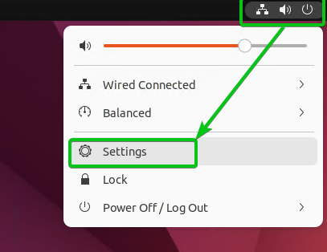

- 在`用户`部分中点击 `解锁`
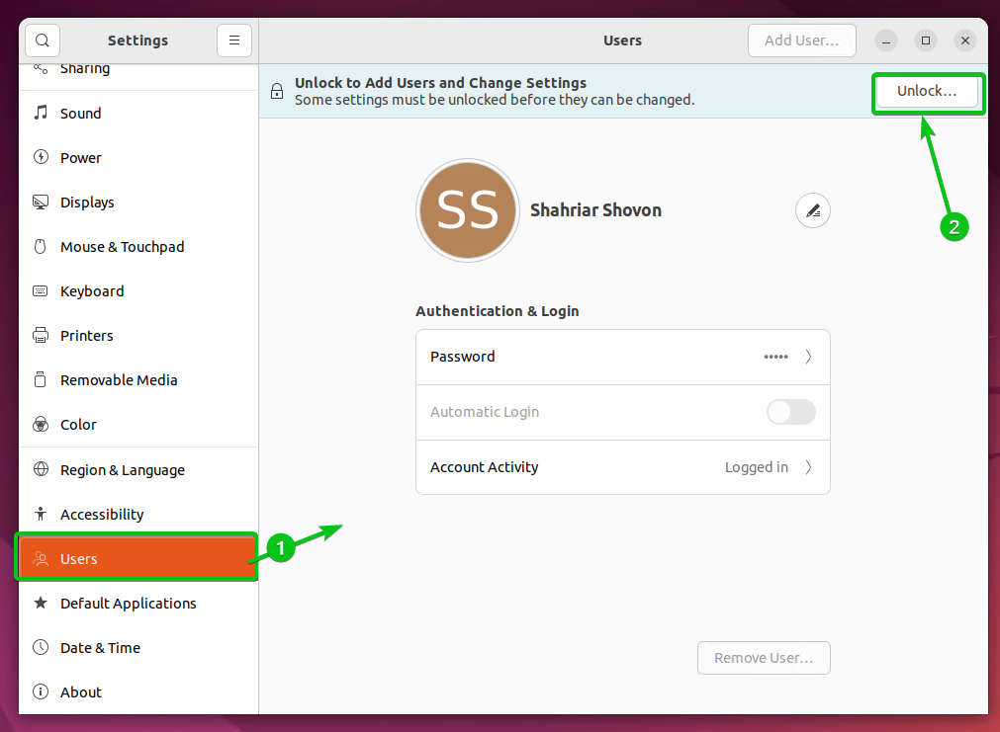

- 输入您的登录密码，然后单击`身份验证`
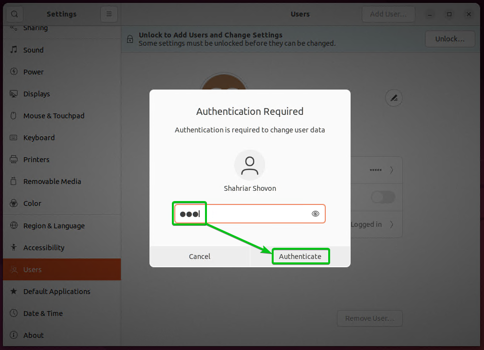

- 单击自动登录切换按钮以启用自动登录。
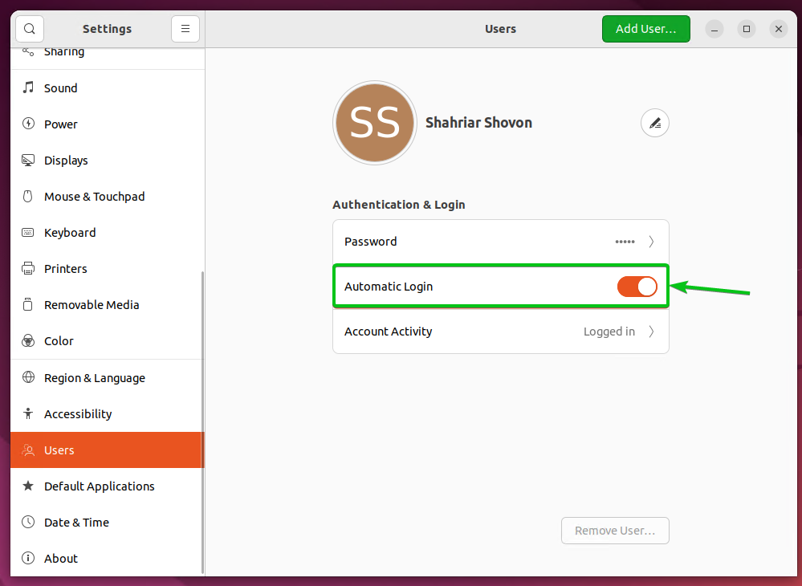

# 1.2 禁用屏幕消隐和自动屏幕锁定
您可以从“设置”应用程序禁用屏幕消隐和自动屏幕锁定。

- 要打开“设置”应用程序，请单击系统托盘中的“设置” ，如下面的屏幕截图所示。


- 单击隐私
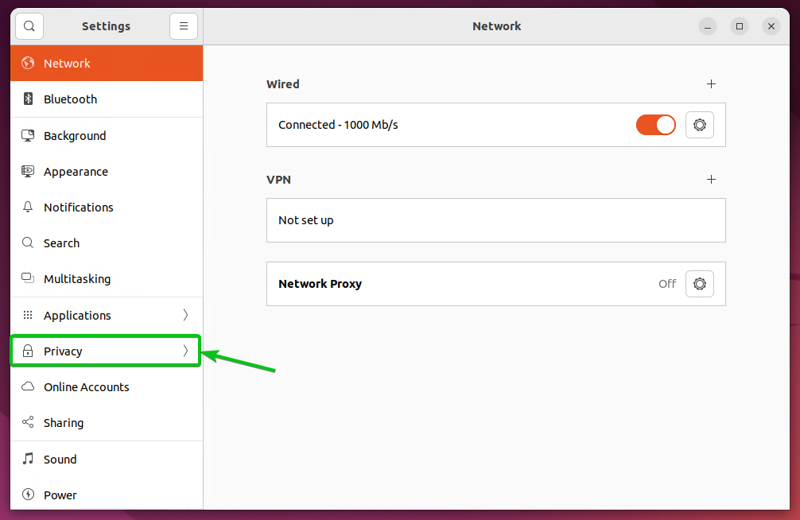
- 在“屏幕”部分，您可以配置“黑屏延迟1”和“自动屏幕锁定2”。
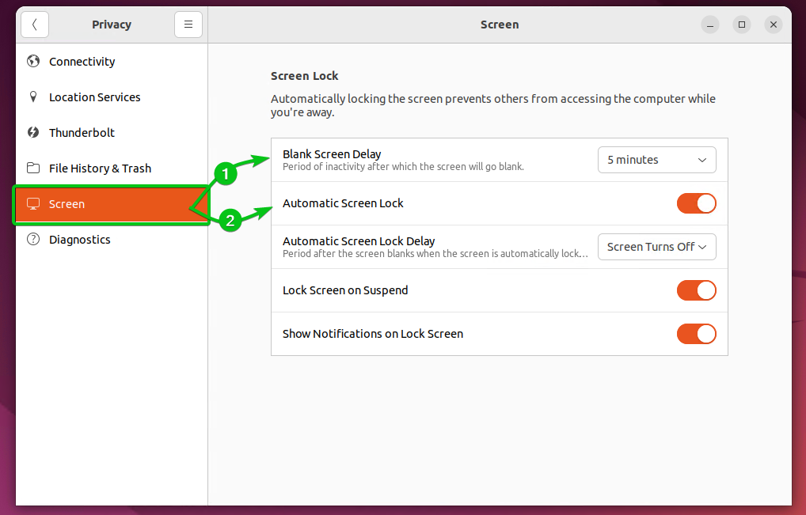
- 要禁用屏幕消隐，您必须从下拉菜单中将“消隐屏幕延迟”设置为“从不” 。单击空白屏幕延迟下拉菜单。
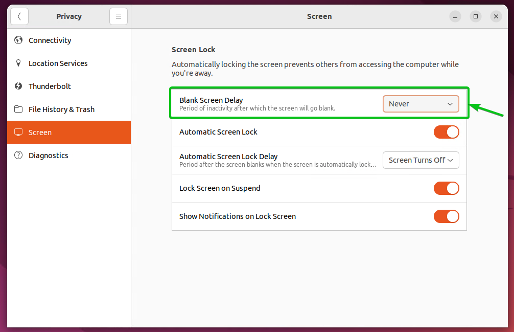
- 要禁用自动屏幕锁定，请单击“自动屏幕锁定”切换按钮关闭，如下面的屏幕截图所示。
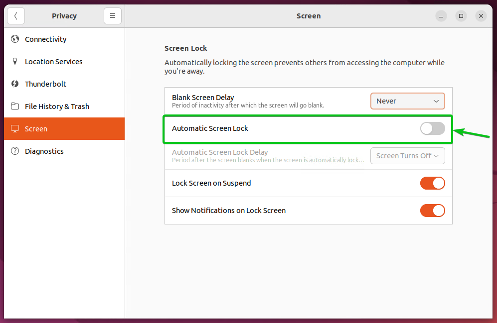

# 2 启动远程桌面
- 您可以从“设置”应用程序在 Ubuntu Desktop 22.04 LTS 上启用远程桌面。
要打开“设置”应用程序，请单击系统托盘中的“设置” ，如下面的屏幕截图所示

</br>
- 在“共享”选项卡1中，使用切换按钮2启用共享。
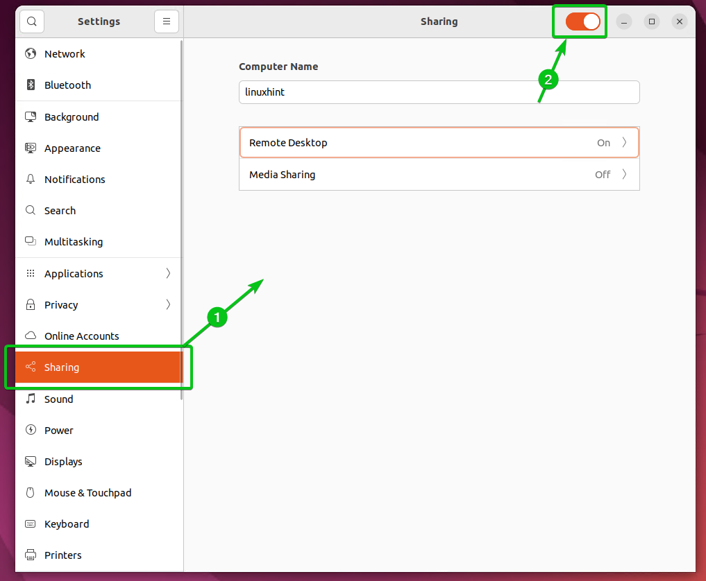
</br>
- 单击远程桌面
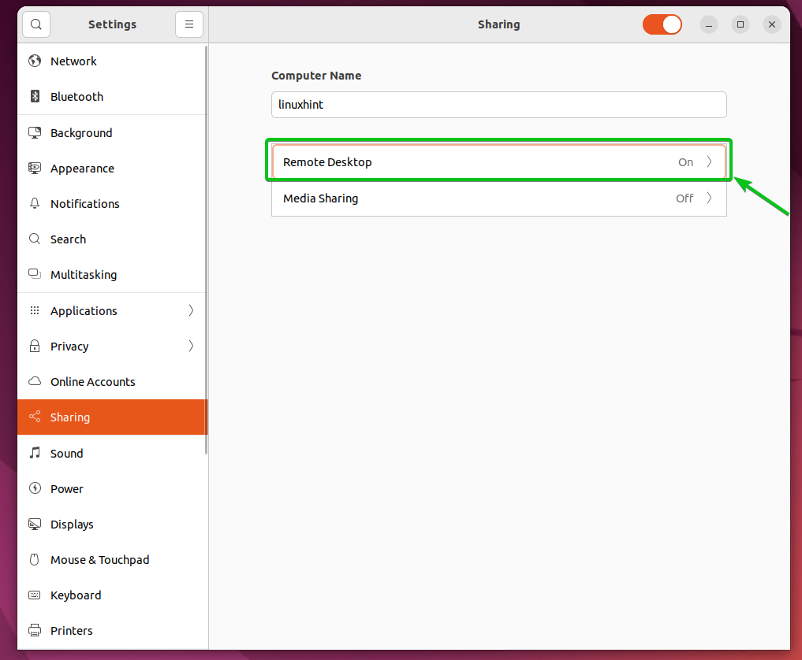
</br>
- 开启远程桌面和远程桌面控制
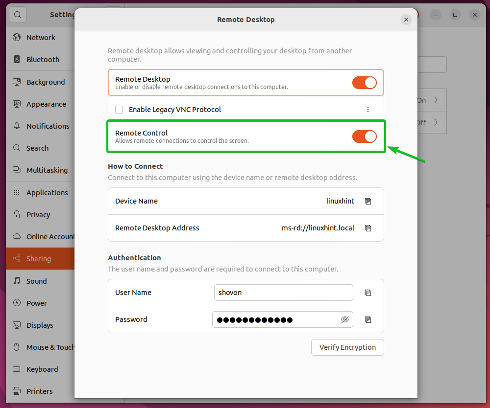

- 还为远程桌面设置用户名和密码。当您在 Windows 10/11 上使用远程桌面连接应用程序远程访问 Ubuntu Desktop 22.04 LTS 时，您设置的用户名和密码将用于身份验证
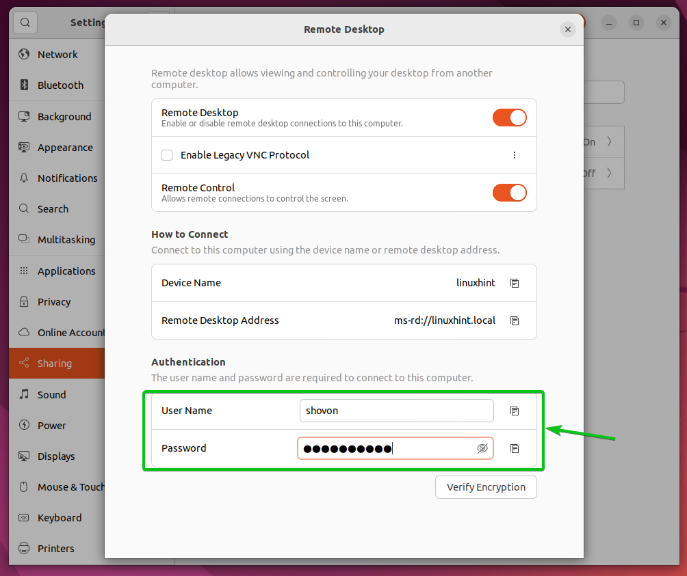

- 完成后，关闭远程桌面窗口。要使更改生效，请重新启动计算机。下次计算机启动时应启用远程桌面。
  
# 3 连接Ubuntu远程桌面
- 要在 Windows 10/11 上使用远程桌面连接应用程序远程访问 Ubuntu Desktop 22.04 LTS，您需要知道计算机的 IP 地址。
在Ubuntu计算机的 IP 地址，请打开终端应用程序并运行以下命令,获取IP地址
    ```shell
    hostname -I
    ```

## 3.1 从 Windows 10/11 远程访问 Ubuntu Desktop 22.04 LTS
您可以在 Windows 10/11 上使用远程桌面连接应用程序（Windows 操作系统的默认 RDP 客户端）来访问远程计算机上运行的 Ubuntu Desktop 22.04 LTS。
- 首先，从Windows 10/11 的开始菜单中搜索远程桌面连接应用程序。找到它后，单击它，如下面的屏幕截图所示。
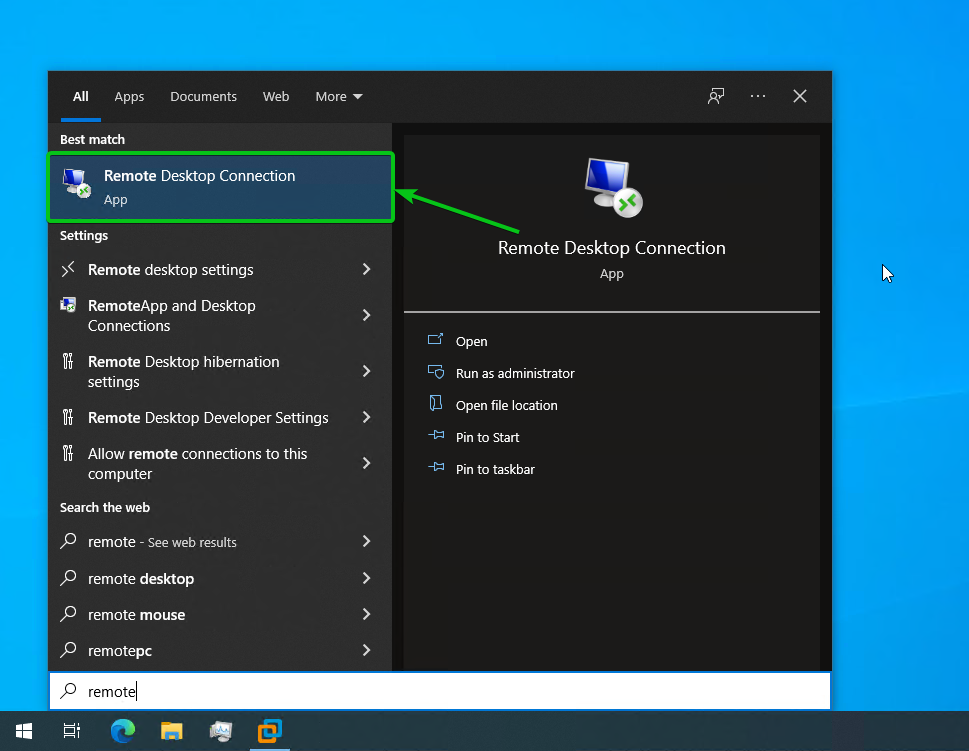

- 打开远程桌面连接应用程序，输入 Ubuntu Desktop 22.04 LTS 计算机的 IP 地址，然后单击“连接”。。
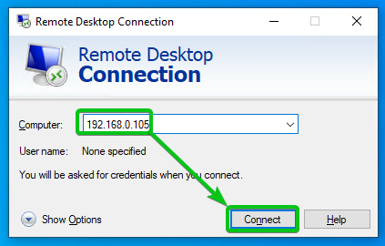

- 建立连接后，系统会要求您输入远程 Ubuntu 计算机的用户名和密码。选择其他用户登录
输入您在 Ubuntu Desktop 22.04 LTS 1上的远程桌面配置期间设置的用户名和密码。
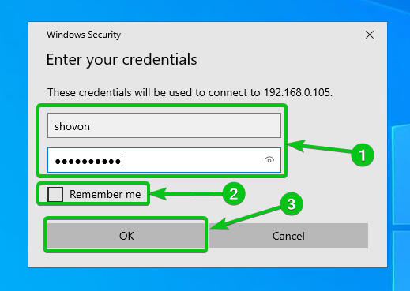
- 系统将要求您验证远程 Ubuntu 计算机的证书。单击“是”进行确认1。
如果您不想在下次尝试远程访问 Ubuntu 计算机时看到此窗口，请选中“不再询问我是否连接到此计算机”复选框2，然后单击“是”。
- 远程桌面连接应用程序应远程连接到您的 Ubuntu 计算机，如下面的屏幕截图所示。
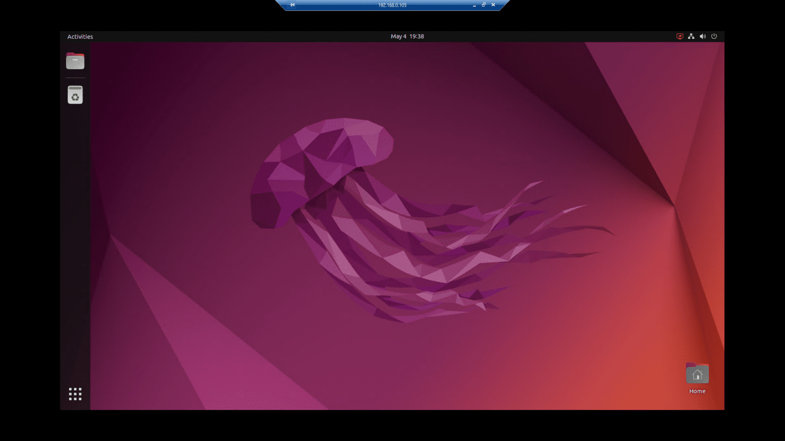


9286