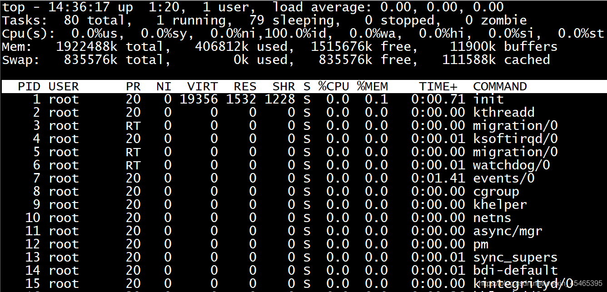

# 1 添加图片
```markdown

```
示例：
```markdown

```
图片路径可以是相对于markdown文件的相对路径

# 2 文档内跳转
## 2.1 跳转到标题
```markdown
[内容](#21-跳转到标题)
```
标题格式： 对于小括号中的标题格式，将标题的中的点去掉，空格用-符号代替。例如标题为`#2.1 跳转到标题`对应`#21-跳转到标题`

## 2.2 跳转到自定义位置
在一个地方设置描点
```markdown
<span id="xxx"></span>
```

需要跳转到锚点时
```markdown
[点击跳转到描点](#xxx)
```

这里的#xxx不能有空格。