# 1 添加图片
```markdown

```
示例：
```markdown

```
图片路径可以是相对于markdown文件的相对路径

# 2 文档内跳转
## 2.1 跳转到标题
```markdown
[内容](#21-跳转到标题)
```
标题格式： 对于小括号中的标题格式，将标题的中的点去掉，空格用-符号代替。例如标题为`#2.1 跳转到标题`对应`#21-跳转到标题`

## 2.2 跳转到自定义位置
在一个地方设置描点
```markdown
<span id="xxx"></span>
```

需要跳转到锚点时
```markdown
[点击跳转到描点](#xxx)
```
这里的#xxx不能有空格。


# 3 mermaid语法

在markdown中使用mermaid前，需要先安装mermaid插件

在markdown中支持使用mermaid语法来画流程图、时序图、类图、状态机图、甘特图、思维导图、象限图.

## 3.1 画时序图

官方文档： https://mermaid.js.org/syntax/sequenceDiagram.html

### 3.1.1 基础流程

```
sequenceDiagram
    actor User as 用户
    participant Client as 客户端
    participant Omni as Omni网关
    participant OmniAccount as OmniAccount服务
    

    User->>Client: 操作
    Client->>Omni: 发送请求
    Omni->>OmniAccount: 转发请求
    OmniAccount->>Omni: 响应
    Omni->>Client: 响应
```

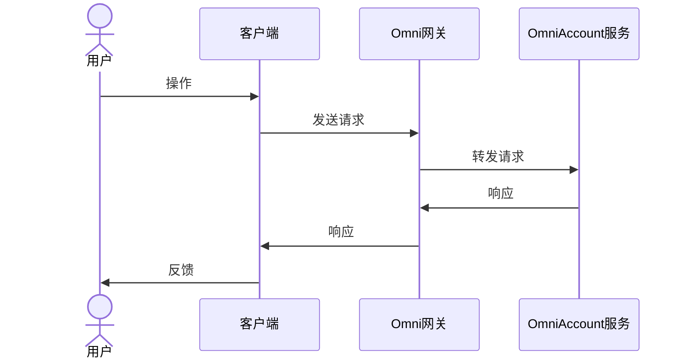

### 3.1.2 不同的组件符号

```
sequenceDiagram
    participant 矩形框
    participant 数据库@{"type":"database"}
    participant 集合@{"type":"collections"}
    participant 队列@{"type":"queue"}
    participant 边界符号@{ "type" : "boundary" }
    participant 控制符号@{"type":"control"}
    participant 实体@{"type":"entity"}
    actor 人物角色
```

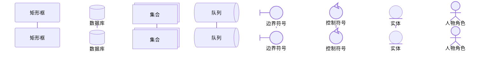

### 3.1.3 循环
```
sequenceDiagram
    loop 循环执行
        John->>John: 检测
    end
    Note right of John: 文字说明
```

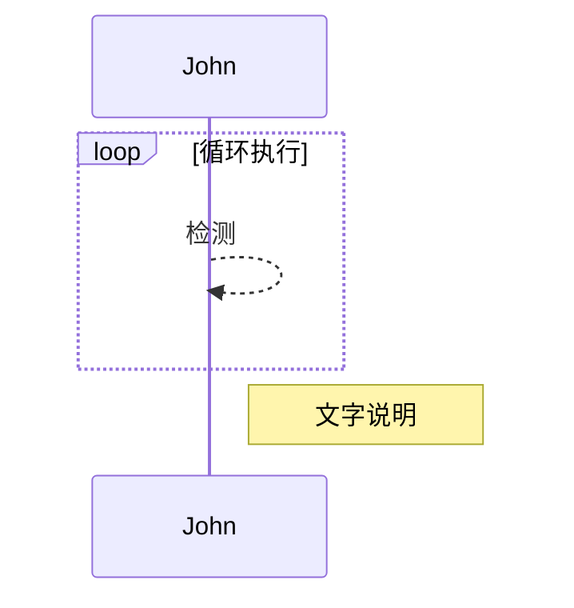

### 3.1.4 分组

```
sequenceDiagram
    box green A和B  (绿色背景)
    participant A
    participant B
    end

    box C和D
    participant C
    participant D
    end
```

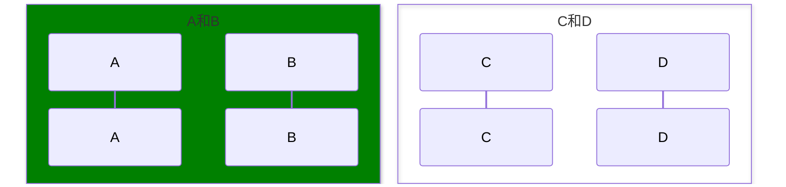

### 3.1.5 箭头样式

消息可以以实线或虚线两种方式显示。


[Actor][Arrow][Actor]:Message text
目前支持十种类型的箭头：

|类型|	描述|
|--|---|
|->|	无箭头的实线|
|-->|	无箭头的虚线|
|->>|	带箭头的实线|
|-->>|	带箭头的虚线|
|<<->>|	带有双向箭头的实线（v11.0.0+）|
|<<-->>|	带有双向箭头的虚线（v11.0.0+）|
|-x|	末端带有十字的实线|
|--x|	末端带有十字的虚线|
|-)|	末端带有开放箭头的实线（异步）|
|--)|	末端带有开放箭头的虚线（异步|

### 3.1.6 激活
可以激活或停用一个参与者。激活（停用）可以是专用的声明：
```
sequenceDiagram
    Alice->>John: Hello John, how are you?
    activate John
    John-->>Alice: Great!
    deactivate John
```

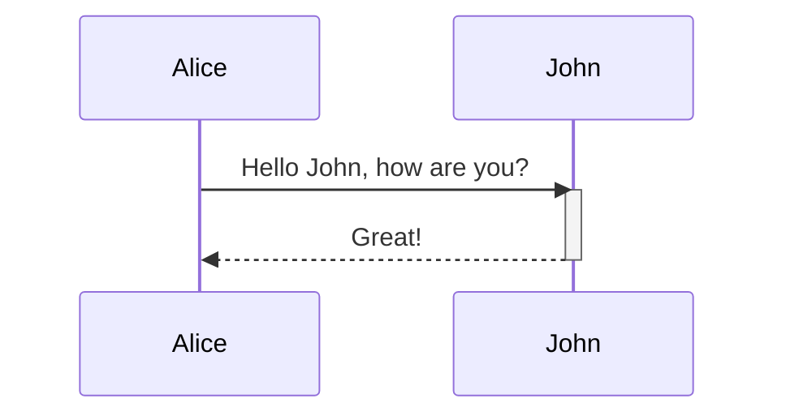

还有一个快捷方式，即在消息箭头后附加+/后缀：-
```
sequenceDiagram
    Alice->>+John: Hello John, how are you?
    John-->>-Alice: Great!
```

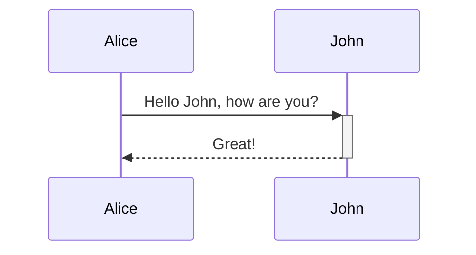

### 3.1.7 备注

可以在序列图中添加注释，备注文字的位置有 right of 、 left of 、 over 

```
sequenceDiagram
    participant John
    Note right of John: Text in note
```

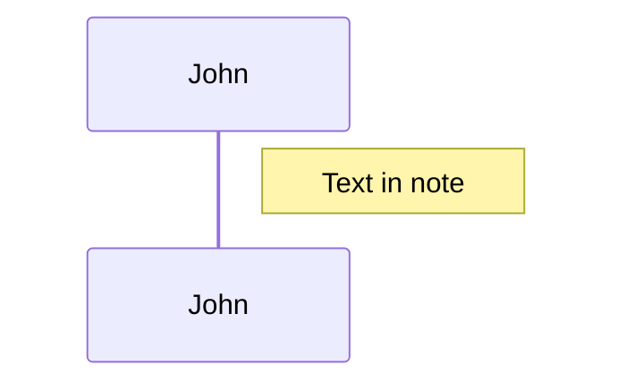

### 3.1.8 换行符
可以在注释和消息中添加换行符：<bt/>

```
sequenceDiagram
    Alice->John: Hello John,<br/>how are you?
    Note over Alice,John: A typical interaction<br/>But now in two lines
```

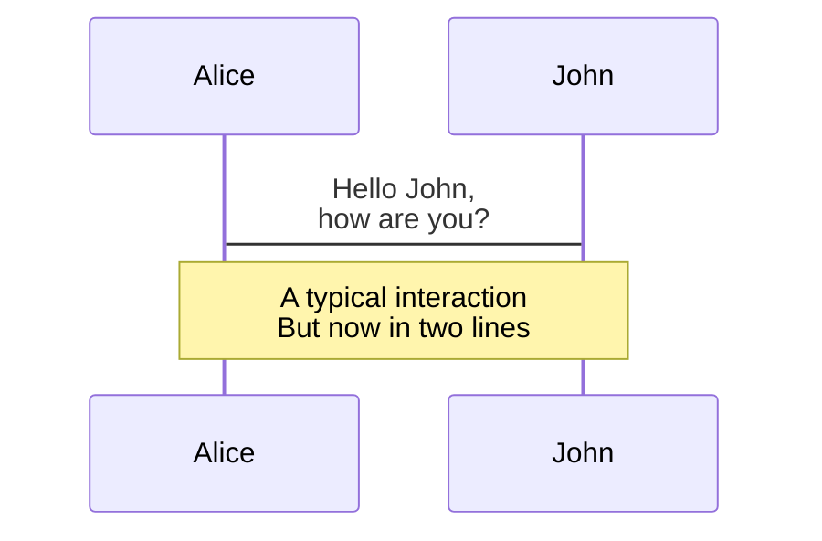

### 3.1.9 序列号

序列图中每个箭头可以附加一个序列号。这可以在将 Mermaid 添加到网站时进行配置，如下所示：

```
<script>
  mermaid.initialize({ sequence: { showSequenceNumbers: true } });
</script>
```

```
sequenceDiagram
    autonumber
    Alice->>John: Hello John, how are you?
    loop HealthCheck
        John->>John: Fight against hypochondria
    end
    Note right of John: Rational thoughts!
    John-->>Alice: Great!
    John->>Bob: How about you?
    Bob-->>John: Jolly good!
```

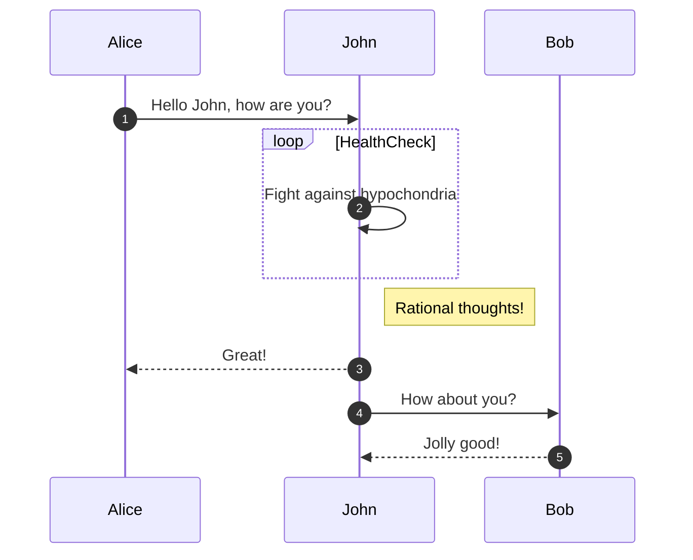

### 3.1.10 break
可以指示流程内序列的停止（通常用于模拟异常）。

这是通过符号来实现的
```
break [something happened]
... statements ...
end
```

示例：
```
sequenceDiagram
    Consumer-->API: Book something
    API-->BookingService: Start booking process
    break when the booking process fails
        API-->Consumer: show failure
    end
```

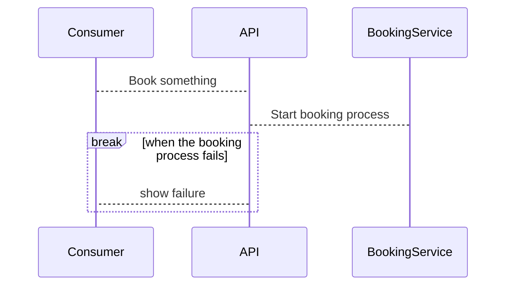


## 3.2 画流程图


Mermaid 的 flowchart（流程图）语法 是最常用的可视化类型之一，用于描述系统流程、逻辑关系、状态流转等。下面我会系统地介绍 Mermaid 的 flowchart 语法，包括基本节点、连接箭头、方向控制、子图（subgraph）、条件分支、样式自定义等。

🧭 一、基本结构
```
flowchart TD
    A[开始] --> B[处理数据]
    B --> C{条件判断?}
    C -->|是| D[执行操作1]
    C -->|否| E[执行操作2]
    D --> F[结束]
    E --> F
```

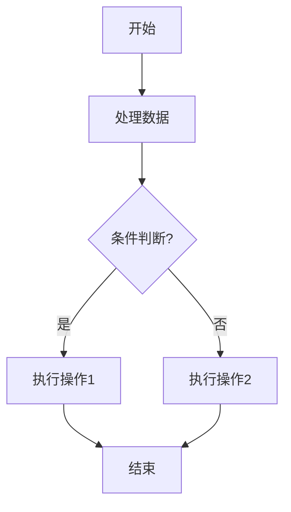


说明：

flowchart 或 graph 都可用于声明流程图。

TD 表示方向（见下节）。

每行表示一个连接（边）。

[ ] 是矩形节点，{ } 是菱形判断节点。

🧩 二、方向声明
代码	含义
TD	从上到下（Top → Down）
BT	从下到上（Bottom → Top）
LR	从左到右（Left → Right）
RL	从右到左（Right → Left）
TB	同 TD

示例：

flowchart LR
    A --> B --> C

🪄 三、节点类型与形状
| 语法        | 外观 | 含义         |
| --------- | -- | ---------- |
| `A[文本]`   | ▭  | 矩形         |
| `A(文本)`   | ⭘  | 圆角矩形       |
| `A((文本))` | ⊙  | 圆形         |
| `A>文本]`   | ⧠  | 不规则矩形（带阴影） |
| `A{文本}`   | ⬣  | 菱形（条件判断）   |
| `A[[文本]]` | ⧈  | 子程序/数据库样式  |
| `A[(文本)]` | ⛁  | 数据库样式      |


示例：
```
flowchart TD
    A[矩形] --> B(圆角矩形)
    B --> C{判断}
    C --> D[[子程序]]
    D --> E[(数据库)]
```

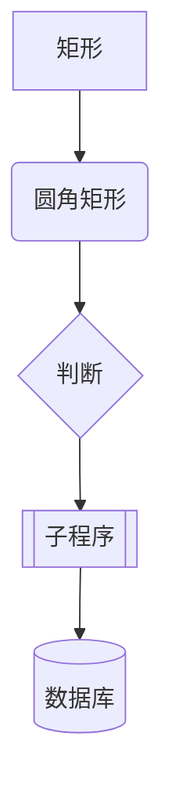


🔗 四、连接箭头
| 语法              | 说明        |
| --------------- | --------- |
| `A --> B`       | 普通箭头      |
| `A --- B`       | 无箭头线      |
| `A -.-> B`      | 虚线箭头      |
| `A ==> B`       | 粗箭头       |
| `A -- 文字 --> B` | 带标签箭头（推荐） |


示例：
```
flowchart TD
    A --> B
    A -.-> C
    A ==> D
    A -- 条件1 --> E
```

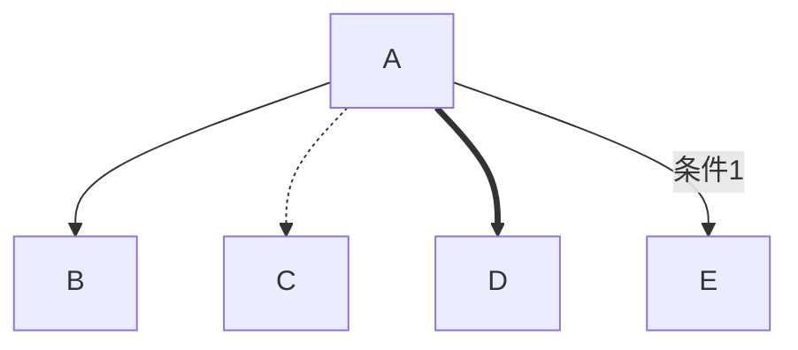

🧱 五、子图（subgraph）
```
flowchart TD
    subgraph 用户登录流程
        A[输入账号密码] --> B[验证]
    end
    B --> C[登录成功]
```

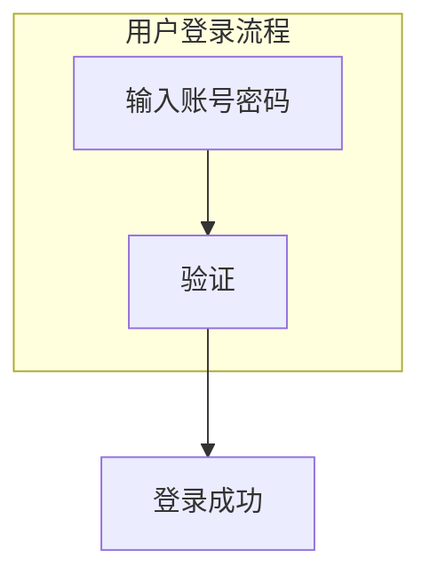


subgraph 名称 与 end 成对使用。

子图可嵌套。

⚖️ 六、条件与分支
```
flowchart TD
    A[开始] --> B{是否登录?}
    B -->|是| C[进入主页]
    B -->|否| D[跳转登录页]
    C --> E[结束]
    D --> E
```

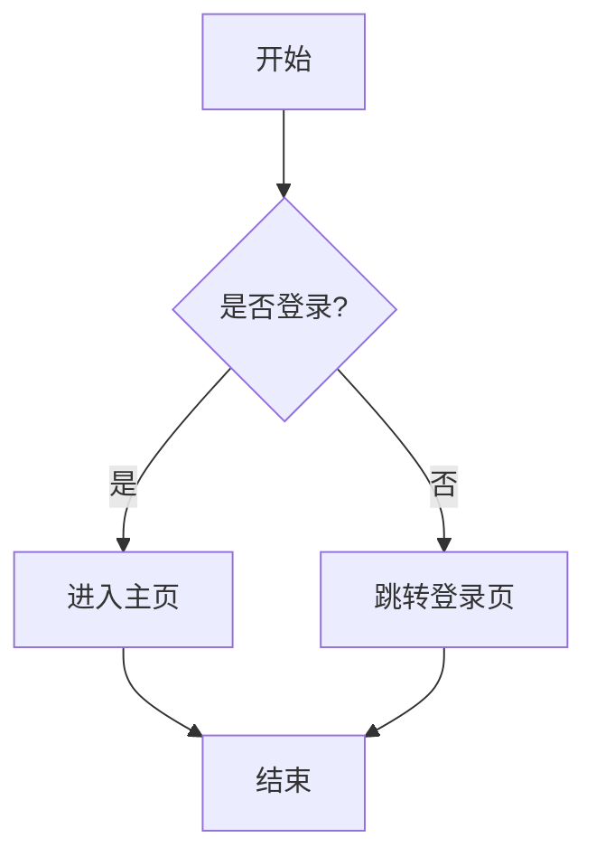

🎨 七、样式与自定义颜色
1. 单个节点样式
```
flowchart TD
    A[普通] --> B[高亮]
    style B fill:#f96,stroke:#333,stroke-width:2px,color:white
```

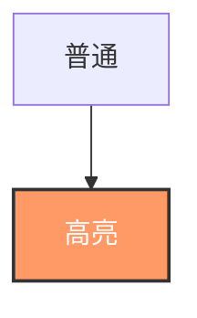

2. 类选择器式样式定义
```
flowchart TD
    classDef success fill:#9f9,stroke:#393;
    classDef error fill:#f99,stroke:#933;
    A[开始] --> B[成功]
    A --> C[失败]
    class B success
    class C error
```

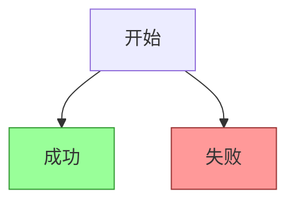

🧮 八、复杂节点组合示例
```
flowchart LR
    A((开始)) --> B[加载配置]
    B --> C{配置有效?}
    C -->|是| D[初始化模块]
    C -->|否| E[报错退出]
    D --> F>运行中...]
    E --> F
```

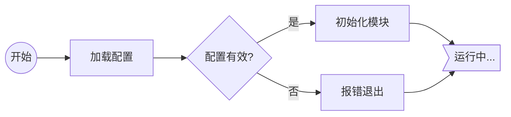

🧰 九、注释与空行

使用 %% 表示注释。

空行可分隔模块，增强可读性。

```
flowchart TD
    %% 初始化阶段
    A[启动] --> B[加载配置]

    %% 主逻辑
    B --> C{是否正常?}
```

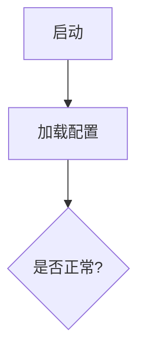
