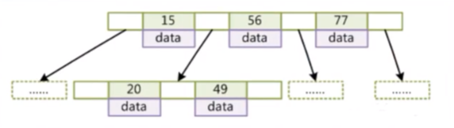
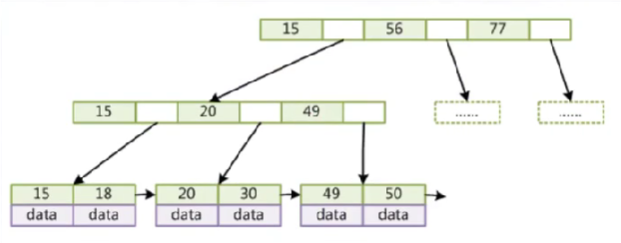
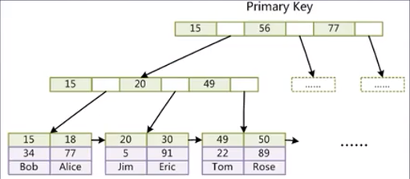
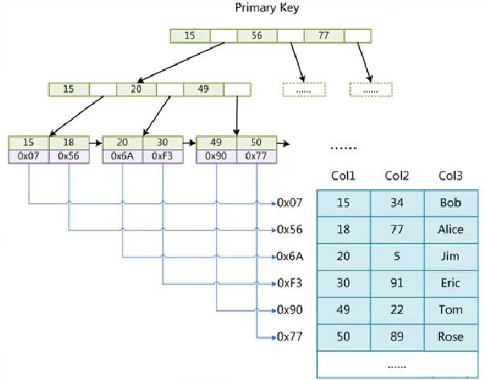
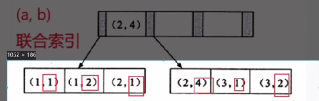

[toc]
# 1 索引介绍
MySQL索引的建立对于MySQL的高效运行是很重要的，索引可以大大提高MySQL的检索速度。
创建索引时，你需要确保该索引是应用在 SQL 查询语句的条件(一般作为 WHERE 子句的条件)。
实际上，索引也是一张表，该表保存了主键与索引字段，并指向实体表的记录。
缺点：虽然索引大大提高了查询速度，同时却会降低更新表的速度，如对表进行INSERT、UPDATE和DELETE。因为更新表时，MySQL不仅要保存数据，还要保存一下索引文件。

建立索引会占用磁盘空间的索引文件。
# 2 添加索引
## 2.1 添加索引
```sql
CREATE INDEX <indexName> ON <table_name> (column_name)
```
示例：
```sql
# 给book表添加name索引，索引名为idx_name
create  index idx_name ON book(name);

# 给book表添加name,age的联合索引，索引名为idx_name
create  index idx_name ON book(name，age);
```
## 2.2 创建时添加索引
在创建索引的时候也可以添加索引
```sql
CREATE TABLE mytable(  
    `ID` INT NOT NULL,   
    `username` VARCHAR(16) NOT NULL,  
    primary key(ID)
    INDEX <indexName> (username(length))  
)engine=InnoDB default charset=utf8;  
```
注意对于varchar类型的字段，创建索引的时候要跟上用作索引的长度length，那么该字段的前length个字符就会被当作索引

## 2.3 添加唯一索引
添加唯一索引后，成为索引的那个字段不允许有重复的值
```sql
# 给book表添加name索引，索引名为idx_name
create unique index idx_name ON book(name);

# 给book表添加name,age的联合索引，索引名为idx_name
create unique  index idx_name ON book(name，age);

# 在创建表的时候添加唯一索引
create table if not exists `tt`( 
    id INT AUTO_INCREMENT, 
    name CHAR(12), 
    UNIQUE INDEX (name), # 添加唯一索引
    PRIMARY KEY (id)
)engine=InnoDB default charset=utf8;
```

# 3 索引的底层原理
## 3.1 B+树
数据库存储索引的数据结构是B+树，之所以不用红黑数或二叉树，是因为在大数据下，红黑树的高度会变得不可控；二叉树在顺序插入的情况下会退化成链表。
在说B+树之前，先看看B树
**B树**：
- 叶节点具有相同的深度，叶节点的指针为空
- 所有索引元素不重复
- 叶节点的数据索引从左到右递增排列

由此可见B树的一个节点上有多个元素，元素的值从左到右递增，这样可以有效控制树的高度。 

**B+树**：
- 非叶子节点不存储data，只存储索引(冗余)，可以放更多的索引
- 叶子节点包含所有索引字段
- 叶子节点用指针连接，提高区间访问的性能


图中的数字是索引，空格是存储指向下一个节点的指针。MySQL给B+树的节点设置的大小是16Kb, 给指向子节点的指针分配的内存占6字节。一般来说采用的主键索引类型是bigint(占8字节)。由此可以计算出一个节点可以存放约1170个索引，如果B+树的高度为3(设叶子节点的data占1字节)，那么整颗树可以存储的索引个数为1170x1170x16 = 21902400。 这样只需要一个高度为3的B+树就可以存储2千多万条索引，而且一般来说，MySQL的B+树根节点是常驻内存的，因此查找时可以减少一次磁盘IO

B+树相对于B树来说，进行了2个改造：
- B+树将B树节点的数据移到了叶子节点，因此同等高度下，B+树存储的数据量大于B树
- B+树给叶子节点之间添加了双向指针，提高了范围查找的查找效率。B树如果要进行范围查找还需要回溯到父节点然后再寻子节点，而B+树直接通过叶子节点的指针进行范围查找。

MySQL存储引擎之所以选择B+树而不是B树，也是因为以上两点


# 4 聚集索引
聚集索引的索引和数据是存放在同一个文件中的，例如MySQL中的InnoDB存储引擎用的就是聚集索引。

对于InnoDB, 索引和数据信息存储在.ibd文件下，表的结构信息存储在.frm文件下。
InnoDB表必须要有索引并且推荐使用整形自增主键，如果创建表的时候没有指定主键，那么会使用一个隐藏列来作为主键，从而来组织B+树。

之所以推荐使用整形自增的值作为主键，而不是用uuid。
- 在查找过程中需要频繁的比较大小，通过整型的比较要比字符串比较更高效
- 整型所占用的空间比uuid小
- 使用自增属性，再插入的时候可以更快速的插入。如果不是按升序插入，B+树在插入的时候更容易分裂，降低插入效率

**扩展**：
MySQL底层存储数据结构除了可以用B+树来组织外，还可以用Hash<font color=gray>(MyISAM和InnoDB存储引擎只支持BTREE索引；MEMORY和HEAP存储引擎可以支持HASH和BTREE索引)</font>。使用Hash可以通过Hash运算很快地将要查找的索引获取到对应的存储地址，其查找效率要B+树查找更高。但Hash对于范围查找不能很好的支持。因此几乎所有的MySQL数据库都用的B+树来组织的数据结构。而B+树就能很好的支持范围查找
因为B+树的叶子节点之间也是通过**双向指针**连接起来的，而且从左到右依次递增。当我们找到一个索引的叶子节点时，如果要查找比它大的索引，只需要通过叶子节点之间的指针就可以快速地找到。


# 5 非聚集索引
非聚集索引的的索引文件和数据文件是分离的，比如MySQL的MyISAM存储引擎用的就是非聚集索引

对于MyISAM存储引擎，索引是存储在.MYI文件下，数据是存储在.MYD文件下，表结构信息存储在.frm文件下。如上图中，存储索引的B+树下的叶子节点存储的是指向对应数据的磁盘文件地址。

# 6 联合索引
联合索引就是2个以上的字段联合起来的索引。
**创建联合索引**：
```sql
REATE TABLE IF NOT EXISTS `test`( 
    id INT AUTO_INCREMENT, 
    `name` CHAR(21) NOT NULL,
     `age` TINYINT NOT NULL, 
     PRIMARY KEY (id), 

     # 创建name,age的联合索引，索引名为idx_name_age, 也可以不写索引名
     KEY `idx_name_age` (name,age) USING BTREE 
)ENGINE=INNODB DEFAULT CHARSET=utf8 COMMENT="ttt";
```
通过联合索引构建B+树时，排序方式是先比较第一个字段，如果第一个字段的值相同，再比较下一个字段。比如以上的创建的联合索引中，进行比较时，先比较name字段，再比较age字段

# 7 唯一联合索引
唯一联合索引是在联合索引的基础上，限制作为索引的字段组合的值不能重复
**创建唯一联合索引**：
在创建表的时候创建索引
```sql
create table if not exists `ttt`(
     id int auto_increment, 
     name char(3),
      age int, 
      primary key(id), 

      # 创建唯一联合索引
      unique index `idx_name_age` (age,name)
)engine=InnoDB default charset=utf8 comment="test";
```

给已存在的表添加唯一联合索引
```sql
ALTER TABLE `表名` ADD UNIQUE INDEX(字段名1, 字段名2, ...);
```

# 8 索引失效
## 8.1 没有按照最左前缀匹配来进行查询
如果定义了联合索引, 字段(a, b, c, d). 而进行查询的时候没有按照最左匹配原则进行查找，那么本次查询这个索引就会失效，即本次查询的时候不会用这个索引进行查宅

**失效原理：**
在使用索引(a,b,c,d)进行组建B+树的时候，在插入数据的时候，会先比较a字段，如果a字段的值相同，再比较b字段的值，依次往后。这样会形成B+树的叶子节点从左往右是依次递增的。因此如果在a相等的情况下，b字段的排序一定是有序的。而不按照最左前缀匹配原则来查找，那就意味着中间某个字段的值是被忽略的。这样不看前一个字段，仅看后一个字段的话，它的排序不一定是递增的，如下图，但看叶子节点的第二个值，并不是按序排列的。

因此如果进行查找时，没有按照最左前缀原则进行查找，例如条件使用的(a,c)字段，因为没有看b字段，因此c字段的值在全表来看不一定按序排列，因此不能用索引来查找，只能进行全表扫描，从而导致索引失效。

## 8.2 LIKE语句导致索引失效
在查询的时候，如果对于LIKE的`%`在左边会造成索引失效，`%`在右边不会造成索引失效。
例如
```sql
# 索引失效
explain select * from  `Book` where name like "%jk";

# 索引不失效
explain select * from `Book` where name like "jk%";
```

如果想要like语句在左边也能是索引生效，可以使用覆盖索引----即select的字段是索引字段。

**like失效的原因**：
- `%`号在右: 由于B+树的索引顺序，是按照首字母的大小进行排序，%号在右的匹配又是匹配首字母。所以可以在B+树上进行有序的查找,查找首字母符合要求的数据。
- `%`号在左:是匹配字符串尾部的数据，我们上面说了排序规则，尾部的字母是没有顺序的，所以不能按照索引顺序查询，就用不到索引.
- 两个`%`号:这个是查询任意位置的字母满足条件即可，只有首字母是进行索引排序的，其他位置的字母都是相对无序的，所以查找任意位置的字母是用不上索引的.

# 9 回表
大家知道，MySQL 中的索引有很多种不同的分类方式，可以按照数据结构分，可以按照逻辑角度分，也可以按照物理存储分，其中，按照物理存储方式，可以分为聚簇索引和非聚簇索引。
我们日常所说的主键索引，其实就是聚簇索引（Clustered Index）;主键索引之外，其他的都称之为非主键索引，非主键索引也被称为二级索引（Secondary Index），或者叫作辅助索引。
对于主键索引和非主键索引，使用的数据结构都是 B+Tree，的区别在于叶子结点中存储的内容不同：
- 主键索引的叶子结点存储的是一行完整的数据。
- 非主键索引的叶子结点存储的则是主键值。

这就是两者大的区别。

所以，当我们需要查询的时候：

1. 如果是通过主键索引来查询数据，例如```select * from user where id=100```，那么此时只需要搜索主键索引的 B+Tree 就可以找到数据。
2. 如果是通过非主键索引来查询数据，例如 ```select * from user where username='javaboy'```，那么此时需要先搜索 username 这一列索引的 B+Tree，搜索完成后得到主键的值，然后再去搜索主键索引的 B+Tree，就可以获取到一行完整的数据。

对于第二种查询方式而言，一共搜索了两棵 B+Tree，二级索引B+Tree 拿到主键值后再去搜索主键索引的 B+Tree，这个过程就是所谓的**回表**。

**一定会回表吗？**
那么不用主键索引就一定需要回表吗？不一定！
如果查询的列本身就存在于索引中，那么即使使用二级索引，一样也是不需要回表的。
例如我们创建了一个联合索引(name,age,scol), 当我们使用```select name,age from `user` where name="jake"```时，因此该联合索引对应的B+树中就存在(name,age,scol)数据，因此可以直接获取到，不需要回表。

## 9.2 回表的过程
当我们通过二级索引查找到满足条件的记录时，如果select的字段中有不存在于二级索引，那么就需要回表。因为我们在二级索引树中查询到的数据中也包含了主键，因此可以在主键索引表中根据获取到的主键查询记录

# 10 索引下推
索引下推（Index Condition Pushdown）是MYSQL5.6版本的新特性。
如果能在二级索引中拿到对应的数据，就先直接过滤数据，最后满足条件再回表。
- 索引下推可以减少回表的次数。
- 对于innoDB引擎，索引下推(ICP)只适用于二级索引（辅助索引）。

如果在SQL语句中使用了子查询，子查询条件不能下推（即存储引擎无法调用存储函数）

**需要注意的是**，索引下推只在某些情况下才能生效，例如使用B-Tree索引并且条件中包含可下推的比较操作符号（例如等于、小于、大于等），以及条件中没有使用OR操作符或非索引列


## 10.1索引下推过程：
当我们使用```select * from tuser where name like "张%" and age=10;```
这会先通过匹配name以'张'开头匹配，然后再通过age=10匹配到数据。之后在进行回表 查出*


非索引下推过程：
1. 通过联合索引查询到name="张%"对应的“张猛”和“张三”的ID
2. 再通过2次回表查询到“张猛”和“张三”的完整数据，再分别用age=10再进行过滤


**举个例子**，我们有一个数据表customer，其中有三个列 id、name 和 age，我们创建了一个联合索引idx_name_age，包含name和age两列：
```sql
CREATE TABLE customer (
  id INT PRIMARY KEY,
  name VARCHAR(50),
  age INT
);

CREATE INDEX idx_name_age ON customer (name, age);
```
现在我们想查询名字为Tom且年龄小于30的客户，我们可以使用以下查询语句：
```sql
SELECT id, name, age FROM customer WHERE name = 'Tom' AND age < 30;
```
这个查询可以被优化器转换为如下形式：
```sql
SELECT id, name, age FROM customer WHERE age < 30 AND name = 'Tom';
```
这时候MySQL会将 WHERE条件中的age < 30下推到索引idx_name_age中进行计算，找到age<30的数据，然后再在age<30的数据中过滤满足name = 'Tom'条件的子集，而不是扫描整个数据表。（需要满足age和tom是联合索引）

如果按照MySQL5.6之前的版本不使用索引下推，那么就会先通过age<30条件在二级索引树下筛选出符合条件的记录，获取它们的主键id。之后在主键索引树中查找id对应的记录，再筛选满足name='Tom'的记录

由于没有利用索引信息，MySQL需要在整个数据表中查找符合条件的记录，这需要耗费更多的时间和资源，降低了查询性能。对于大型数据表或复杂查询，非索引下推的查询速度更慢，更显著地体现索引下推的优势。


