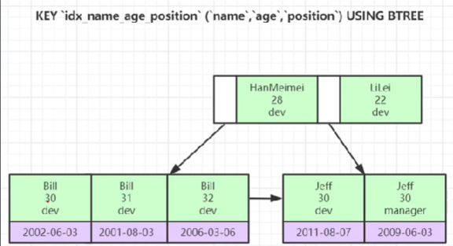

[toc]
# 1 最左前缀匹配
我们所创建的联合索引，是由多个字段组合起来的，当我们进行SQL语句查询的时候，如果查询条件中的字段是这个来联合索引的子集，并且是这个索引定义时的最左。那么本次查询就会用到索引，从而提高查询效率。

例如我们声明联合索引的时候，是通过（a, b, c, d）字段的顺序定义的。那么当我们的SQL查询语句条件是(a)、（a, b）、（a,b,c）、（a,b,c,d）时，就可以使用索引。
CREATE TABLE `test`(
    `id` INT AUTO_INCREMENT,
    `a` INT UNSIGNED NOT NULL,
    `b` char(12) NOT NULL,
    `c` INT,
    `d` CHAR,
    PRIMARY KEY (id),
    KEY (a,b,c,d)
)ENGINE=InnoDB DEFAULT CHARSET=utf8 COMMENT="use to test";
```
对于以上的表，对于下面几条查询语句
```sql
# 会使用到索引
SELECT * FROM `test` WHERE a=1;

# 会使用到索引
SELECT * FROM `test` WHERE a=1 AND b="e";

# 会使用到索引
SELECT * FROM `test` WHERE a=1 AND b="e" AND c=2;

# 会使用到索引
SELECT * FROM `test` WHERE a=1 AND b="e" AND c=2 AND d="t";

# 不满足最左匹配原则，不会使用索引
SELECT * FROM `test` WHERE a=1 AND c=2;
```

## 1.1 最左前缀匹配的原理
联合索引是通过B+树的方式建立起来的，会按照索引定义的字段顺序去比较大小，如果前一个字段的值相等，就用后一个字段的值进行比较。通过这样的方式，索引树的叶子节点的索引值一定是从左往右递增的。这样在前一个字段相等的情况下，后一个字段的排序一定是有序的。

当我们定义了一个联合索引(a,b,c,d), 我们使用(a,c)字段作为条件去查询的时候，因为没有b字段的条件(插入的时候b字段要比c字段先判定)， 因此满足条件的c字段的节点可能在当前叶子节点的左边，也可能在右边，没有办法进行准确查找。

例如下图，当我们查询age=30,position=dev的记录时，因为没有name字段，因此在第一个节点时，存在age=30,position=dev的节点可能在左边，也可能会在右边。因为单独看age字段，该B+树的age字段并不是排好序的


-+