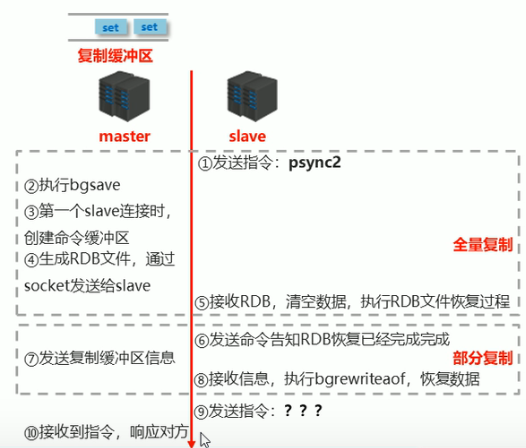

[toc]
# 1 主从复制简介
## 1.1 互联网"三高"架构
互联网架构有高并发、搞性能、高可用的特性。
**高并发**：我们所搭建的网络需要支持大量用户同时访问服务器的能力。
**高性能**: 处理请求的速度比较快
**高可用**: 服务器的可用性高
$可用性 = 一年对外提供服务总时间 \div 一年的时间 \times 100\% $
业界所追求的可用性为99.999%,即服务器年宕机时长低于315秒，约5.25分钟。
## 1.2 单机Redis的风险与问题
对于单机redis,有可能出现以下问题：
- 机器故障
   当单机redis服务器发送故障时，那么该服务就不可使用了。并且会伴随这数据丢失，可能对业务造成<font color=red>灾难性打击</font>。
- 容量瓶颈
   单机的redis服务器内存容量有限，且不能无限升级内存，因为穷且硬件条件跟不上。</br>

由此可见，单点Redis服务器一旦出现问题就很难解决。为了避免单点Redis服务器故障，准备多台服务器并互相连通。将数据复制多个副本保存到多台服务器上，它们<font color=red>连接在一起</font>保证数据的<font color=red>同步</font>。即使有其中一台服务器宕机，其他服务器依然可以继续提供服务，实现Redis的高可用，同时实现数据<font color=red>冗余备份</font>。

## 1.3 多台服务器连接方案（主从复制架构）
将多台服务器通过网络连接起来，一台用于写入redis数据，并将写入的数据同步发送到其他服务器上，负责写入数据的这台主机称为master。然后其他服务器用于读数据，当有redis客户端用户需要读数据时，就从这些服务器上读取，这些服务器称为slave。
像这样我们就搭建好了一个<font color=red>主从复制架构</font>。

像这样的架构最主要的内容就是将数据从master复制到slave, 即数据同步。
在主从复制架构中，master的职责就是写数据并将数据同步到其他slave服务器上。master几乎不提供读数据服务。
slave服务器的职责就是读数据，且<font color=red>禁止</font>写数据。因为如果slave也在写数据，并且没有将数据同步出去，那么数据就会不一致.

## 1.4 主从复制的作用--高可用集群
使用主从复制架构，可以实现**高可用**。
- 由于提供读数据的redis服务器有多台，那么即使其中一台因为意外宕机了，其他redis服务器依然可以继续提供服务。
- 即使master服务器宕机了，由于slave服务中有master的数据备份，可以从slave中选举一个出来充当master
- 如果master在运行期间数据压力很大，也可以在某一个slave下再追加一层slave服务器，从而形成多级master-slave。
  
- 也可以使用多台master来构建主从复制架构（利用哨兵）

由此可见，主从复制的作用：
- **实现读写分离**：master写，slave读，提高了服务器的读写负载能力
- **负载均衡**：基于主从结构，配合读写分离，由slave分担master负载。并根据需求的变化，改变slave的量，通过多个节点分担数据读取负载，大大提高Redis服务器并发量与数据吞吐量。
- **故障恢复**： 当master出现问题时，由slave提供服务，实现快速的故障恢复
- **数据冗余**：实现数据热备份，是持久化之外的一种数据冗余方式
- **高可用基石**：基于主从复制，构建哨兵模式与集群，实现Redis的高可用方案。

#  2 主从复制过程
对于构建主从复制架构，有如下问题需要解决：
- **连接问题**：怎么将主从节点连接起来?
- **数据同步**：连接完成后，需要将数据从master同步到各个slave中
- **命令传播**：数据同步完成后，对于master后续接收到的写命令，需要将对应的命令传给slave。


## 2.1 主从复制的三个阶段
  主从复制可以分为三个阶段
  - 建立连接阶段
  - 数据同步阶段
  - 命令传播阶段
### 2.1.1 建立连接阶段
在这个阶段是有salve去连接master.

1. slave通过指令```slaveof```去连接master
<table><tr><td bgcolor=gray></br>

```shell
# 连接ip:port的master，自己成为它的slave
slaveof ip port
```
</td></tr></table>

2. master收到消息后会相应该消息
3.  slave收到master的相应后 会保存master的ip与端口号。
4. 然后根据保存的信息创建连接master的socket, 之后就通过这个socket来与master进行通信。
5. 之后slave就会周期性地向master发送ping
6. master收到salve发过来的ping指令后会回复pong。通过ping--pong来确认master是否还存在
7. 因为master对外提供功能，因此有可能会涉及到[权限验证](#get_aceess)。例如master设置了密码，slave需要做权限校验。
8. master收到slave发来的密码后，master会验证。
9. slave还会将自己的端口发送给master，告诉master通过这个端口来对该slave进行监听。
10. master收到slave的端口信息后会保存，这样以后master要来找这个slave也会比较方便。

至此，master与slave的主从复制的建立连接阶段完毕。到这一步，slave保存了master的IP与端口， master保存了slave的端口，并且master与slave之间建立了socket连接。

**搭建主从结构**
让slave与master建立主从连接的方式有以下种
- 客户端发送命令
slave的redis客户端执行以下命令，使该redis客户端对应的redis-server成为ip:port的一个slave. 如下图

<table><tr><td bgcolor=gray></br>

```shell
# 连接ip:port的master，自己成为它的slave
slaveof ip port
```
</td></tr></table>

- 启动服务器参数
<table><tr><td bgcolor=gray></br>

```shell
# 在启动服务器的时候，将自己设置为ip:port的slave
redis-server --slaveof <master_ip> <master_port>
```
</td></tr></table>

- 服务器配置

```shell
# 将自己设置为ip:port的slave
slaveof <master_ip> <master_port>
```

示例：
1. 配置master的redis服务器的配置文件
```shell
# 文件名 redis-master-6379.conf
bind 127.0.0.1
port 6379
daemonize no
dir /home/jake/Programing/redis/redis-5.0.0/working
#logfile redis-server-6379.log
```
2. 配置slave的redis服务器的配置文件
```shell
# 文件名 redis-slave-6380.conf
bind 127.0.0.1
port 6380
slaveof 127.0.0.1 6379
daemonize no
dir /home/jake/Programing/redis/redis-5.0.0/working
# logfile slave-6380.log
```
3. 先运行master服务器
```shell
redis-server redis-master-6379.conf
```
4. 再启动salve服务器
```shell
redis-server redis-salve-6380.conf
```

**出现结果**:
在master上出现打印
```shell
13370:M 17 Mar 2023 23:31:11.132 * Replica 127.0.0.1:6380 asks for synchronization
13370:M 17 Mar 2023 23:31:11.132 * Full resync requested by replica 127.0.0.1:6380
13370:M 17 Mar 2023 23:31:11.132 * Starting BGSAVE for SYNC with target: disk
13370:M 17 Mar 2023 23:31:11.132 * Background saving started by pid 13412
13412:C 17 Mar 2023 23:31:11.156 * DB saved on disk
13412:C 17 Mar 2023 23:31:11.156 * RDB: 0 MB of memory used by copy-on-write
13370:M 17 Mar 2023 23:31:11.246 * Background saving terminated with success
13370:M 17 Mar 2023 23:31:11.246 * Synchronization with replica 127.0.0.1:6380 succeeded

```

salve服务器有打印
```shell
13408:S 17 Mar 2023 23:31:11.131 * Ready to accept connections
13408:S 17 Mar 2023 23:31:11.131 * Connecting to MASTER 127.0.0.1:6379
13408:S 17 Mar 2023 23:31:11.131 * MASTER <-> REPLICA sync started
13408:S 17 Mar 2023 23:31:11.131 * Non blocking connect for SYNC fired the event.
13408:S 17 Mar 2023 23:31:11.131 * Master replied to PING, replication can continue...
13408:S 17 Mar 2023 23:31:11.132 * Partial resynchronization not possible (no cached master)
13408:S 17 Mar 2023 23:31:11.132 * Full resync from master: 51846fc39716436b5cdea7e42b169126ff7e38bc:0
13408:S 17 Mar 2023 23:31:11.246 * MASTER <-> REPLICA sync: receiving 175 bytes from master
13408:S 17 Mar 2023 23:31:11.247 * MASTER <-> REPLICA sync: Flushing old data
13408:S 17 Mar 2023 23:31:11.247 * MASTER <-> REPLICA sync: Loading DB in memory
13408:S 17 Mar 2023 23:31:11.247 * MASTER <-> REPLICA sync: Finished with success

```
5. 使用redis-cli连接master服务器
```shell
redis-cli -h 127.0.0.1 -p 6379
```
6. 使用redis-cli连接slave服务器
```shell
redis-cli -h 127.0.0.1 -p 6380
```
7. 在master服务器的客户端上执行写redis的命令
<table><tr><td bgcolor=black>
<font color=white>
127.0.0.1:6379> set name jake</br>
OK
</font>
</td></tr></table>
8. 在slave的客户端执行获取redis数据的命令

<table><tr><td bgcolor=black>
<font color=white>
127.0.0.1:6380> get name</br>
"jake"
</font>
</td></tr></table>

**结论**:
可见在构建master-slave架构后，在master上进行写入的数据会同步到slave上。

我们可以在master的redis客户端上通过执行info replication命令来查看该master连接的slave信息。
<table><tr><td bgcolor=black>
<font color=white>
127.0.0.1:6379> info replication</br>
# Replication</br>
role:master</br>
connected_slaves:1</br>
slave0:ip=127.0.0.1,port=6380,state=online,offset=1680,lag=1</br>
master_replid:51846fc39716436b5cdea7e42b169126ff7e38bc</br>
master_replid2:0000000000000000000000000000000000000000</br>
master_repl_offset:1680</br>
second_repl_offset:-1</br>
repl_backlog_active:1</br>
repl_backlog_size:1048576</br>
repl_backlog_first_byte_offset:1</br>
repl_backlog_histlen:1680</br>
<font>
</td></tr></table>

- role: 扮演的角色master/slave
- connected_slaves: 连接slave的数量
- slave0: 第一个slave的信息
  - ip: IP地址
  - port: 端口号
  - state: 该slave的状态（online:在线）
  - offset: 偏移量
  - lag: slave延迟时长（单位L:秒），为0或1算正常

也可以在slave的redis的客户端运行info replication命令来查看所连master的信息：
<table><tr><td bgcolor=black>
<font color=white>
127.0.0.1:6380> info replication</br>
# Replication</br>
role:slave</br>
master_host:127.0.0.1</br>
master_port:6379</br>
master_link_status:up</br>
master_last_io_seconds_ago:2</br>
master_sync_in_progress:0</br>
slave_repl_offset:2310</br>
slave_priority:100</br>
slave_read_only:1</br>
connected_slaves:0</br>
master_replid:51846fc39716436b5cdea7e42b169126ff7e38bc</br>
master_replid2:0000000000000000000000000000000000000000</br>
master_repl_offset:2310</br>
second_repl_offset:-1</br>
repl_backlog_active:1</br>
repl_backlog_size:1048576</br>
repl_backlog_first_byte_offset:1</br>
repl_backlog_histlen:2310</br>
<font>
</td></tr></table>

- role: 扮演的角色：slave代表该服务器是一个slave
- master_host: master的IP地址
- master_port: master的端口号

**授权访问**：
<span id="get_aceess"></span>
如果master设置了密码，slave在去连接的时候还需要输入密码,相关命令和配置文件如下：
- master在配置文件中设置密码
<table><tr><td bgcolor="#87CEFA"></br>

```shell
# master设置密码的配置文件
# 如果配置了这个参数，那么来连这个redis-server的客户端在连接上
# 后，需要通过密码验证后才能通过redis命令来访问服务器。
requirepass <password>
```
</td></tr></table>

- master客户端发送命令来设置密码
<table><tr><td bgcolor="#87CEFA"></br>

```shell
# master通过命令设置密码
config set requirepass <password>

# 获取密码
config get requirepass
```
</td></tr></table>

- slave客户端发送命令设置密码
  如果服务器设置了密码，客户端虽然可以连接上服务器，但是需要发送密码验证后才能访问数据。
<table><tr><td bgcolor="#87CEFA"></br>

```shell
# slave通过命令来发送验证密码
auth <password>
```
</td></tr></table>

- 在启动slave服务器时，通过参数传递验证密码
  通过--masterauth参数来指定验证密码
```shell
# 使用redis-slave-6380.conf中的配置进行启动，同时使之成为
# 127.0.0.1：6379的salve，验证密码为zxcvbnm1997
redis-server redis-slave-6380.conf --slaveof 127.0.0.1 6379 --masterauth zxcvbnm1997
```

以下是没有进行密码验证的客户端

<table><tr><td bgcolor=black>
<font color=white>
127.0.0.1:6379> get name</br>
(error) NOAUTH Authentication required.</br>
</font>
</td></tr></table>
进行密码验证后：
<table><tr><td bgcolor=black>
<font color=white>
127.0.0.1:6379> auth zxcvbnm1997</br>
OK</br>
127.0.0.1:6379> get name</br>
"jake"</br>
</font>
</td></tr></table>

- slave通过配置文件来设置密码
  
<table><tr><td bgcolor="#87CEFA"></br>

```shell
# slave通过配置文件来设置密码
masterauth <password>
```
</td></tr></table>

对于没有进行密码验证的slave，也无法访问master的数据并且会循环去连接master并循环打印如下日志。必须在启动slave的配置文件中添加如上配置才能连接。
```
2339:S 18 Mar 2023 18:07:24.450 * Retrying with SYNC...
2339:S 18 Mar 2023 18:07:24.450 # MASTER aborted replication with an error: NOAUTH Authentication required.
2339:S 18 Mar 2023 18:07:25.473 * Connecting to MASTER 127.0.0.1:6379
2339:S 18 Mar 2023 18:07:25.473 * MASTER <-> REPLICA sync started
2339:S 18 Mar 2023 18:07:25.473 * Non blocking connect for SYNC fired the event.
2339:S 18 Mar 2023 18:07:25.473 * Master replied to PING, replication can continue...
2339:S 18 Mar 2023 18:07:25.474 * (Non critical) Master does not understand REPLCONF listening-port: -NOAUTH Authentication required.
2339:S 18 Mar 2023 18:07:25.474 * (Non critical) Master does not understand REPLCONF capa: -NOAUTH Authentication required.
2339:S 18 Mar 2023 18:07:25.474 * Partial resynchronization not possible (no cached master)
2339:S 18 Mar 2023 18:07:25.474 # Unexpected reply to PSYNC from master: -NOAUTH Authentication required.
```

- 启动客户端的时候用参数来设置密码
<table><tr><td bgcolor="#87CEFA"></br>

```shell
# 在启动master服务器的客户端时通过这个参数来设置,才能连接上
redis-cli -a <password>
```
</td></tr></table>

### 2.1.4 断开主从连接
```shell
# slave客户端进行执行，主动断开与master的连接
slaveof no one
```

## 2.2 数据同步阶段 
在slave初次连接master后，会将master的全部数据同步到slave中，最终达到slave的数据库状态跟master当前数据库状态一致。

### 2.2.1 数据同步过程
1. slave向master发送psync2指令请求同步数据
2. master接受到命令后执行bgsave命令将当前数据库的信息保存起来，用于后续发送给slave。
3. 除此之外，如果这是第一个slave连接时，master还会创建[复制缓冲区](#copy-buffer "保存接收到的redis操作命令，用于aof")，将执行bgsave期间接受到的命令存起来，等待bgsave的数据发送给slave后在将这期间收到的写命令发送给slave完成数据同步。（因为在bgsave期间也有可能其他客户端在向master中写数据）
4. bgsave生成RDB文件后，通过建立连接阶段的socket将RDB文件发送给slave。
5. salve收到RDB数据后，清空全部数据，然后执行RDB文件恢复过程。
6. RDB恢复完成后会向master发送指令告知masterRDB恢复已经完成。请求部分同步数据。
7. master收到指令后，会发送命令缓冲区中的指令给salve
8. slave收到后，执行bgrewriteaof, 恢复数据。至此数据同步完成。


### 2.2.2 数据同步阶段的注意事项
**对于master**：
- 如果master的数据量过大，数据同步阶段应该避免流量高峰期，避免造成master阻塞，影响业务正常执行。
- 复制缓冲区大小如果设置不合理，可能会导致数据溢出。
  如果进行全量复制的时间周期太长，在执行全量复制的时候，向复制缓冲区中写入的数据超过了缓冲区的容量，那么后面的数据就会丢失。这样进行部分复制的时候就会发现数据已经存在丢失情况，这时候会触发第二次的全量复制。如果再次进行部分复制的时候也发现数据溢出就又会重复全量复制，这样会致使slave陷入死循环状态。
  **修改之法**：在master的配置文件中配置
  ```shell
  repl-backlog-size 1mb
  ```
  来修改复制缓冲区的容量来避免这样的事情。
- master单机内存占主机内存的比例不应该过大，建议50%-70%的内存，留下30%-50%的内存用于执行bgsave命令和创建复制缓冲区。

**对于slave**：
- 为避免slave进行全量复制、部分复制时服务器响应阻塞或数据不同步，建议关闭期间的对外服务。通过配置参数
  ```shell
  # 参数设置成yes，主从复制中，从服务器可以响应客户端请求
  # 参数设置成no，主从复制中，从服务器将阻塞所有请求，有客户端请求时返回“SYNC with master in progress”；
  slave-serve-stale-data yes|no
  ```
- 数据同步阶段，master给slave发送信息可以理解为master是slave的一个客户端，主动向slave发送命令
- 多个slave同时对master请求数据同步，master发送的RDB文件增多，会对带宽造成冲击，造成master的CPU占用很高，性能下降。因此应该适量错峰进行连接master。
- slave过多时，建议调整拓扑结构，由一主多从结构变为树状结构，中间节点既是master也是slave。注意使用树状结构时，由于层级的加深，导致深度越高的slave与最顶层的master的数据同步延迟较大，数据一致性变差，应谨慎选择。

## 2.3 命令传播阶段
命令传播阶段是在完成master与slave的连接和数据同步后的一个阶段，主要用于将master接受到的数据发送给各个slave，实现数据的同步。
在这个阶段也会存在部分复制和全量复制的情况。主要发生在以下情况。
|情况|处理方式|
|----|-------|
|网络闪断闪连|忽略|
|短时间网络中断|部分复制|
长时间网络你中断|全量复制|


### 2.3.1 命令传播阶段的概念
在进行学习之前，需要先了解几个概念
**服务器运行id(runid)**:
- **概念**： 服务器运行ID是每一台redis服务器每次运行的身份识别码，一台服务器运行多次可以生成多个运行id
- **组成**： 运行id由40位字符组成，是一个随机的十六进制字符
  例如：a9ikkl26dnc026fo87zplm25b1q7s6c9xu00bdy5
- **作用**：运行id被用于在服务器之间进行传输，识别身份。如果两次操作均对同一台服务器进行，必须每次操作携带对应的运行id用于对方识别。
- **实现方式**:运行id在每台服务器启动的时候自动生成，master在首次连接slave时，会将自己的运行ID发送给slave， slave保存此ID。通过```info server```命令查看节点的runid.

示例：
<table><tr><td bgcolor=black>
<font color=white>
127.0.0.1:6379> info server</br>
# Server</br>
redis_version:5.0.0</br>
redis_git_sha1:00000000</br>
redis_git_dirty:0</br>
redis_build_id:7df7f7e18b133cc9</br>
redis_mode:standalone</br>
os:Linux 5.4.0-84-generic x86_64</br>
arch_bits:64</br>
multiplexing_api:epoll</br>
atomicvar_api:atomic-builtin</br>
gcc_version:7.5.0</br>
process_id:2103</br>
</font>
<font color="87CEFB">
run_id:814c9c4a16e69405824baa9b16af67a2a14550b2</br>
</font>
<font color=white>
tcp_port:6379</br>
uptime_in_seconds:58</br>
uptime_in_days:0</br>
hz:10</br>
configured_hz:10</br>
lru_clock:1489442</br>
executable:/home/jake/Programing/redis/redis-5.0.0/config/redis-server</br>
config_file:/home/jake/Programing/redis/redis-5.0.0/config/redis-master-6379.conf</br>
</font>
</td></tr></table>

**复制缓冲区**:
- **概念**：当master与多个slave连接以后，当收到命令后，由master的命令传播程序将命令发送给每一个slave。除此以外，命令传播程序还会将命令存放到一个缓冲区，这个缓冲区就是复制缓冲区。
这是一个先进先出的队列，默认大小1Mb,当入队元素的数量大于队列长度时，最先的元素就会被弹出，而新的元素被放入队列中。
- **作用**: 复制缓冲区保存master接收到的全部写命令和select命令。当有一个salve因为意外断网时，如果这期间master有命令传输给slave,那么断网的这个slave就会接收不到数据，这时候，这个slave的数据状态就会和master以及其他接受到命令的slave不一致。这时候就需要将复制缓冲区中存放的命令发生给断网重连的salve,保证了数据的一致性。
- **复制缓冲区创建时机**:每台服务器启动时，如果开启了AOF或者被连接成为master节点，就会创建复制缓冲区。
- **组成**： 复制缓冲区由偏移量和字节值组成。
- **复制缓冲区的工作原理**：
1. 当有redis命令到达master时，master会将redis命令转化为RDB格式,然后将转化后的数据按对应的字符挨个存入复制缓冲区中。
   
   
   master通过偏移量来记录不同slave的当前数据传播的差异，而slave也需要记录自己当前数据在复制缓冲区的偏移量。
  
**复制偏移量**：
- **概念**：一个数字，描述复制缓冲区中的指令字节的位置
- **分类**：
  - master复制偏移量：记录发送给所有slave的指令字节对应的位置(多个)
  - slave复制偏移量： 记录slave接收到master发送过来的指令对应的位置(一个)
- **数据来源**:
  master端： 发送一次记录一次
  slave端： 接受一次记录已一次
- **作用**：
  同步信息，比对master与slave的差异，当slave断线后，恢复时使用。如果master的slave的数据偏移量不同，master则重新发送差值区间的数据。

### 2.3.2 命令传播过程
1. 在slave第一次连接master时，因为什么信息都没有，因此会向master发送```psync2 ？ -1```来请求全部数据。
2. master收到```psync2 ? -1```后，会执行bgsave生成RDB文件，并记录当前的复制偏移量。
3. 准备好数据后，会发送+FULLRESYNC runid offset(全量同步)命令给slave，在这里slave知晓了master的runid和复制偏移量。通过socket将RDB文件发送给slave.
4. slave收到+FULLRESYNC命令后保存master的runid和offset. 然后清空当前全部数据，通过socket接受到的RDB文件恢复RDB数据。(1~4步是全量复制过程)

5.当slave中有master的信息后，会发送```psync2 runid offset```命令给master
6. master接收到命令后，判定runid是否跟自己的runid一致、判定offset是否存在复制缓冲区中。
7. 如果runid或offset有一个不满足，则重新执行执行2步（全量复制） .
   如果通过，就会继续比对slave的offset和master的offset是否一样，如果一样则忽略。
   如果不一样就执行部分复制-----发送```+CONTINUE offset```命令给salve告知<font color=red>master的复制偏移量</font>。同时, 通过socket发送复制缓冲区中<font color=red>master的offset</font>到<font color=blue>slave的offset</font>到区间的数据给slave. 这里的<font color=red>master的offset</font>是master给slave发送后数据的偏移量，因此一定存在<font color=red>master的offset</font>  **>**  <font color=blue>slave的offset</font>
8. slave收到+CONTINUE命令后，保存master的offset. 接受到信息后执行bgrewriteaof,恢复数据。


## 2.4 心跳机制
进入命令传播阶段后，master与slave之间需要进行信息交换,使用心跳机制进行维护，实现双方连接保持在线。
- **master心跳任务**
  - 指令：PING
    master向slave发送ping指令
  - 周期： 根据repl-ping-slave-period决定，默认是10秒
  - 作用： 判断slave是否在线
  - 查询： info relication  获取slave最后一次连接时间间隔，lag（slave的延迟时长）字段维持在0或1视为正常。

- **slave心跳任务**
  - 指令： replconf ACK{offset}
  - 周期： 1秒
  - 作用： 
      1. 汇报slave自己的复制偏移量，获取最新的数据变更指令
      2. 判断master是否在线。 

### 2.4.1 心跳阶段的注意事项
- 当slave多数掉线时或延迟过高时，master为保障数据稳定性，将拒绝所有信息同步操作。
```shell
# slave数量少于2个时，强制关闭master写功能
min-slaves-to-write 2

# 所有slave的延迟时长都大于10秒时，强制关闭master写功能
min-slaves-max-lag 8
```
示例：
如果在slave数量少于配置的min-slaves-to-write的数量时，在master进行写数据时会发生：
<table><tr><td bgcolor=black>
<font color=white>
127.0.0.1:6379> set name terry</br>
(error) NOREPLICAS Not enough good replicas to write.</br>
</font>
</td></tr></table>

- slave数量由slave发送replconf ACK命令做确认，看由几个不同slave发送ACK
- slave延迟由发送replcong ACK, 看该ACK距离上次这个slave发送过来的ACK的时间间隔

## 2.5 主从复制常见问题
### 2.5.1 频繁全量复制
**引起频繁全量复制的原因1**:
伴随系统的运行，master的数据量会越来越大，一旦master重启，runid也会发生变化，会导致slave的全量复制操作。
**内部优化调整**：
1. master内部创建master_repl_id变量，使用runid相同的策略生成，长度41位，并发送给所有的slave
2. 在master关闭时执行shutdown save，进行RDB持久化，将runid与offset保存到RDB文件中。
可以通过redis-check-rdb命令来查看该信息。（终端运行，而不是redis终端）
repl-id和repl-offset字段分别对应master_replid和offset
示例：
<table><tr><td bgcolor=black>
<font color=white>
<font color="#87CEFA">jake@ubuntu:~/Programing/redis/redis-5.0.0/working$</font> redis-check-rdb dump.rdb</br>
[offset 0] Checking RDB file dump.rdb</br>
[offset 26] AUX FIELD redis-ver = '5.0.0'</br>
[offset 40] AUX FIELD redis-bits = '64'</br>
[offset 52] AUX FIELD ctime = '1679221635'</br>
[offset 67] AUX FIELD used-mem = '11060464'</br>
[offset 85] AUX FIELD repl-stream-db = '0'</br>
<font color="green">
[offset 135] AUX FIELD repl-id ='a29fe9e67aa4d19b518b2464619a923e5d403aa1'</br>
[offset 150] AUX FIELD repl-offset = '0'</br>
</font>
[offset 166] AUX FIELD aof-preamble = '0'</br>
[offset 168] Selecting DB ID 0</br>
[offset 191] Checksum OK</br>
[offset 191] \o/ RDB looks OK! \o/</br>
[info] 1 keys read</br>
[info] 0 expires</br>
[info] 0 already expired</br>
</font>
</td></tr></table>
3. master重启后加载RDB文件，恢复数据
重启后，将RDB文件中保存的repl-id与repl-offset加载到内存中
 - 将repl-id和offset赋值给master_repl_id和master的offset.这样再次启动的master对外来说就没有区别，slave还会以为是之前的那个master

作用：本机保存上次的runid，重启恢复该值，使所有的slave还以为是之前的master

**引起频繁全量复制的原因2**:
复制缓冲区过小，断网后slave的offset越界，出发全量复制。
在因断网出发全量复制的时候，由于复制缓冲区太小，在执行全量复制期间，复制缓冲区被新的请求占满了。这时候又继续出发全量复制，全量复制期间，复制缓冲区又被站占满，如此循环。
导致slave一直在同步复制数据，不对外提供服务。
**解决之法**： 修改复制缓冲区的大小(repl-backlog-size配置)
**建议设置如下**：
- 测算master到slave的重连平均时长second
- 获取master平均每秒产生写命令数据总量write_size_per_second
- $那么最优复制缓冲区空间 = 2 \times second \times write\_size\_per\_second $

### 2.5.2 频繁的网络中断
**问题现象**： master的CPU占用过高或slave频繁断开连接。

**slave频繁断开连接原因1**:
**问题原因**：

  - slave每秒发送replconf ack命令到master
  - 当slave接到慢查询时(keys *, hgetall等)，会占用大量CUP性能
  - master每秒调用复制定时函数replicationCron(), 比对slave发现长时间没有响应。
    导致master各种资源（输出缓存、带宽、连接等）被严重占用. 当master长时间(超时)没有收到slave的响应，就会把这个slave释放掉。
  
**解决之法**：通过设置合理的超时时间，确认是否释放slave。（```repl-timeout配置```)
 该参数定义了超时时间的阈值，slave未响应master的轮询达到这个时间，master就会断开与这个slave的连接。

**slave频繁断开连接原因2**:
- master发送ping指令频度较低
- master设定超时时间较短
- ping指令在网络中存在丢包

基于以上3中情况，当ping指令发出后，如果其中有ping指令丢包了，那么在master看来，slave可能会响应超时，从而导致master-slave连接被断开（假设因为ping的频度较低，在整个超时时长下，master也只够能发出1条ping指令，而这条ping指令又刚好丢包了，那么在master看来，slave就响应超时了）。
**解决之法**： 提高ping指令的发送频度
超时时间repl-timeout的时间至少是ping指令频度的5~10倍。否则slave很容易被判定超时。
```shell
# master发送ping指令的时间间隔
repl-ping-slave-period seconds

# redis5.0.0版本及其以后也写作,其实作用都是一样的
repl-ping-replica-period seconds
```

### 2.5.3 数据不一致
**问题现象**： 多个slave获取相同数据不同步
**问题原因**： 网络信息不同步
**解决方案**：
  - 优化主从之间的网络环境，通常放置在同一个机房，如使用阿里云等云服务器时要注意此现象
  - 监控主从节点延迟(通过offset)判断，如果slave延迟过大，暂时屏蔽对该slave的数据访问。
  ```shell
  # 设置no后在主从复制过程中仅响应info,slaveof等少数命令（慎用，除非对数据一致性要求很高）一般调试使用no，不对外提供服务
  slave-serve-stale-data yes|no
  ```


# 2.7 主从复制相关的配置汇总
## 2.7.1 master配置
```shell
# master设置密码
requirepass <password>

# 设置复制缓冲区的大小，默认1Mb
# 单位mb,kb,Gb 不区分大小写
repl-backlog-size 1mb

# slave数量少于2个时，强制关闭master写功能
min-slaves-to-write 2

# 所有slave的延迟时长都大于8秒时，强制关闭master写功能
min-slaves-max-lag 8

# slave未响应时间，之后断开与未响应时间超时的slave
repl-timeout 60

# 设置master向slave发送ping指令的频度，间隔seconds秒后发送一次ping
repl-ping-slave-period seconds
```

## 2.7.2 slave配置
```shell
# slave通过配置文件来设置访问master的密码
masterauth <password>

# 参数设置成yes，主从复制过程中，slave服务器可以响应客户端请求
# 参数设置成no，主从复制过程中，slave服务器将阻塞所有请求，有客户端请求时返回“SYNC with master in progress”；
slave-serve-stale-data yes|no
```
