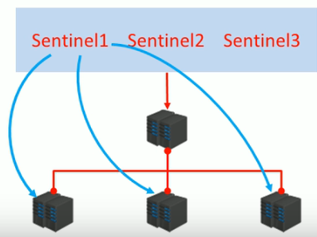

[toc]
# 1 哨兵模式介绍
在主从结构中，如果master宕机，那么就需要从slave中选择其中一个来充当master的角色，并且需要告诉其他slave新的master是谁。而这个过程，就需要哨兵来介入。

为完成这样的操作，有一下几点问题需要解决
1. 谁来确认master宕机了？
2. 怎么找到新的master？
3. 修改配置后，原始的master恢复了怎么办？

**哨兵**：哨兵（sentinel）是一个分布式系统，用于主从结构中的每台服务器进行<font color=red>监控</font>，当出现故障时通过投票机制<font color=red>选择</font>新的master并且将所有slave连接到新的master.


**哨兵的作用**:
  - 监控
    不断检查master和slave是否正常运行、master存活检测、master与slave运行情况检测。
  - 通知
    当监控的服务器出现问题时，向其他（哨兵、客户端）发送通知。
  - 自动故障转移
    断开故障master与slave连接，选取一个slave作为master,将其他slave连接到新的master, 并告知客户端新的服务器地址。

**注意**：
- 哨兵也是一个redis服务器，只是不提供数据服务
- 通常哨兵配置数量为单数---便于投票时票数不打平

# 2 哨兵结构的搭建
配置哨兵的时候哨兵们的配置文件中除了端口不一样，其余的都是一样的。
下面以配置一个一拖二的主从结构的3个哨兵为例：
## 2.1 启动哨兵
```shell
redis-sentinel <哨兵配置文件>
```
## 2.2 哨兵配置文件
```shell
port 26379
bind 127.0.0.1
dir /home/jake/Programing/redis/redis-5.0.0/working

sentinel monitor mymaster 127.0.0.1 6379 2
sentinel down-after-milliseconds mymaster 30000
sentinel parallel-syncs mymaster 1
sentinel failover-timeout mymaster 180000
```
- **sentinel moniter** <font color=blue>mymaster</font> <font color="#87CEFA">127.0.0.1 6379</font> <font color=red>2</font> : 
表示哨兵的名字叫mymaster,  这个名字可以自定义
最后一个2表明，当2个哨兵认为master挂了，那么就判定master挂了，一般设置为哨兵总数量的一半+1， 这也是我们要设置哨兵数量为单数的原因。
127.0.0.1 6379为监听的master的地址
- **sentinel down-after-milliseconds** <font color=blue>mymaster</font> 30000
 表示，当master30000ms时间没有响应，认为master挂了。这里的mymaster需要跟moniter对应。
- **sentinel parallel-syncs** <font color=blue>mymaster</font> 1:
 表示当master被判定挂了之后，需要推选新的master, 推选出来后进行数据同步的时候，设置数据同步的任务线为1，这个值越小，CPU的压力越小，但数据同步越慢，反之亦然。
- **sentinel failover-timeout** <font color=blue>mymaster</font> 180000 :
设置在数据同步的时候，在180000毫秒时间内同步完成将有效。超过180000ms没有同步完成算超时。

## 2.3 搭建哨兵
1. 创建3个哨兵用的配置文件centinel-26379.conf、centinel-26380.conf、centinel-26381.conf
它们除了port配置不一样，其他配置都时一样的。
  <table><tr><td bgcolor=black>
  <font color=gray>
  <font color=gray># centinel conf</font></br>
  port 26379</br>
  bind 127.0.0.1</br>
  dir /home/jake/Programing/redis/redis-5.0.0/working</br>
  sentinel monitor mymaster 127.0.0.1 6379 2</br>
  sentinel down-after-milliseconds mymaster 30000</br>
  sentinel parallel-syncs mymaster 1</br>
  sentinel failover-timeout mymaster 180000</br>
  </font>
  </table></tr></td>

创建一个master配置(port为6379)
<table><tr><td bgcolor=black>
<font color=gray>
<font color=gray># mater conf</font></br>
bind 127.0.0.1</br>
port 6379</br>
daemonize no</br>
dir /home/jake/Programing/redis/redis-5.0.0/working</br>
# requirepass zxcvbnm1997</br>
repl-backlog-size 10mb</br>
repl-timeout 60</br>
repl-ping-replica-period 2</br>
</font>
</table></tr></td>

创建两个slave的配置（port为6380和6381), 均配置为6379的salve。
<table><tr><td bgcolor=black>
<font color=gray>
<font color=gray># slave conf</font></br>
bind 127.0.0.1</br>
port 6380</br>
slaveof 127.0.0.1 6379</br>
daemonize no</br>
dir /home/jake/Programing/redis/redis-5.0.0/working</br>
# master password</br>
# masterauth zxcvbnm1997</br>
</font>
</table></tr></td>
2. 启动：
  先启动master,再启动两个slave, 最后启动3个centinel
  注意启动哨兵用redis-sentinel 命令
  到这里哨兵结构就算搭建完成了。
  
  ```shell
  # 启动哨兵
  redis-sentinel <哨兵配置文件路径>
  ```

3. 在哨兵的客户端执行 info Sentinel命令可以查看关于哨兵的信息。
4. 当我们启动哨兵的服务后，对应的哨兵启动配置文件也会被修改，并且每当有新的哨兵加入的时候，也会在该配置文件中添加对应的信息（对应kown-sentinel）。
<table><tr><td bgcolor=black>
<font color=gray>
port 26379</br>
bind 127.0.0.1</br>
dir "/home/jake/Programing/redis/redis-5.0.0/working"</br>
sentinel myid 93b41c306afe3603d458e47bb76eb413623797cb</br>
sentinel deny-scripts-reconfig yes</br>
sentinel monitor mymaster 127.0.0.1 6379 2</br>
sentinel config-epoch mymaster 0</br>
# Generated by CONFIG REWRITE</br>
maxclients 4064</br>
sentinel leader-epoch mymaster 0</br>
sentinel known-sentinel mymaster 127.0.0.1 26381 b9b9549493eeca2c2cb1c0e62c57297a21fdbf44</br>
sentinel known-sentinel mymaster 127.0.0.1 26380 6e3a988dbc2ae473ee54234ebebee99838bdb1e9</br>
sentinel current-epoch 0</br>
</font>
</table></tr></td>
5. 对于master配置了密码，sentinel的配置文件中也应该要配置对应的密码（猜测）
6. 模拟master挂了之后，看哨兵从slave中推选新的master

    - 将master对应的redis服务进程kill
    - 因为我们哨兵设置的是当master失联30s后，推选新的master
    - 如果旧的master后来重新上线，那它也只会变成新master的slave
