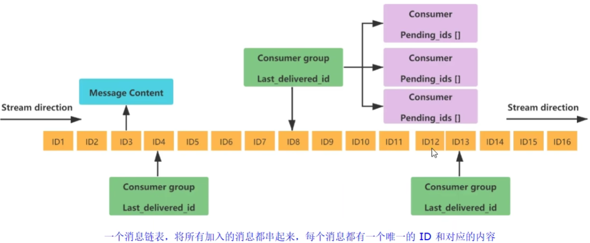
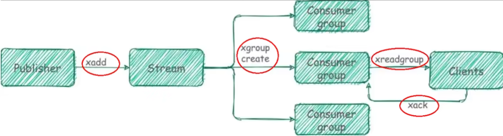
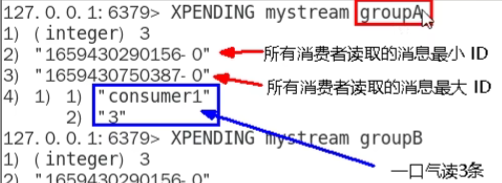

[toc]

# 1 stream介绍
Redis Stream 是 Redis 数据库中的一种数据结构，用于可持久化、有序的记录和发布/订阅消息。它是在 Redis 5.0 版本中引入的一项新功能。
**作用**：实现消息队列，它支持消息的持久化、支持自动生成全局唯一ID、支持ack确认消息的模式、支持消费组模式等，让消息队列更加的稳定和可靠

Redis Stream 类似于一个日志数据结构，它以一个唯一的标识符（ID）来标识每条消息，并将消息按照添加的顺序进行排序。每个消息都包含一个可选的关键字消息字典，其中可以存储消息的其他属性。

使用 Redis Stream，可以实现多个生产者向一个或多个消费者发布消息，并以保留消息历史、消费者组和消息发布订阅的方式处理消息。消费者可以根据需求以不同的方式处理消息，例如消费消息、读取消息等。

Redis Stream 提供了以下几个主要的操作命令：
- [XADD](#2-向stream中添加消息)：向 Stream 中添加一条消息；
- [XRANGE](#4-根据范围查询消息)：按照给定范围返回 Stream 中的消息；
- [XREAD](#3-从stream中读取消息)：从 Stream 中读取消息，支持阻塞和非阻塞模式；
- [XDEL](#5-删除stream中的消息)：删除 Stream 中的消息；
- XGROUP：创建和管理消费者组等。

Redis Stream 在实时数据处理、消息队列等场景中具有广泛的应用，可以实现高可靠性、高性能的消息传递和处理。

# 2 stream的底层结构

|组件|描述|
|----|----|
|Message Content|消息内容|
|Consumer group|消费者组，通过GROUP CREATE命令创建，同一个消费者组可以有多个消费者|
|Laste_delivered id|游标，每个消费组会有个游标last_delivered_id，任意一个消费者读取了消息都会使游标last_delivered_id往前移动。|
|Consumer|消费者|
|Pending ids|消费者会有一个状态变量，用于记录被当前消费已读取但未ack的消息Id，如果客户端没有ack，这个变量里面的消息ID会越来越多，一旦某个消息被ack它就开始减少。这个pending_ids变量在Redis官方被称之为PEL(Pending Entries List)，记录了当前已经被客户端读取的消息，但是还没有ack(Acknowledgecharacter:确认字符），它用来确保客户端至少消费了消息一次，而不会在网络传输的中途丢失了没处理|

# 3 stream相关命令中的特殊符号
|特殊符号|描述|
|-------|----|
|-|最小可能出现的ID|
|+|最大可能出现的ID|
|$|代表特殊ID，表示以当前Stream已经存馓的最大的ID作为最后一个ID，当前Stream中不存在大于当前最大ID的消息，因此此时返回nil|
|>|用于XREADGROUP命令，表示迄今还没有发送给组中使用者的信息，会更新消费者组的最后ID|
|*|用于XADD命令中，让系统自动生成id|

# 4 向stream中添加消息
```shell
xadd key [NOMKSTREAM] [MAXLEN|MINID [=|~] threshold [LIMIT count]] *|ID field value [field value ...]
```
**功能**：
 Redis Stream 数据结构中用于向流中添加消息的命令。XADD 需要指定流的名称和要添加到流中的消息。消息由字段名称和值组成的一系列对来表示。
 <font color=red>注意</font>： 消息ID必须要比上一个ID大

**参数**：
- <font color=red>key</font>：流的名称
- <font color=red>NOMKSTREAM</font>：可选参数
- <font color=red>MAXLEN|MINID [=|~] threshold [LIMIT count]</font>：
- <font color=red>ID</font>: 通常是一个由XADD命令自动生成的递增序列号，但可以手动指定。你可以传入*作为ID，Redis将基于当前时间戳和内部序列为新消息分配一个递增的ID。
- <font color=red>field</font>: 与value一起组成消息字段及其值的列表。至少需要提供一个字段和值。
- <font color=red>value</font>: 与value一起组成消息字段及其值的列表。至少需要提供一个字段和值。

**使用示例**:
```shell
127.0.0.1:6379> xadd person * name jake age 25
"1701785419149-0"
```

## 4.1 ID的组成
"1701785419149-0"
生成的消息 ID，有两部分组成，毫秒时间戳-该毫秒内产生的第几条消息。如果是0表示是在该时间点下产生的第一条消息。`-`后面的数字也被称为信息条目。
信息条目指的是序列号，在相同的毫秒下序列号从O开始递增，序列号是64位长度，理论上在同一毫秒内生成的数据量无法到达这个级别，因此不用担心序列号会不够用。millisecondsTime指的是Redis节点服务器的本地时间，如果存在当前的毫秒时间戳比以前已经存在的数据的时间戳小的话〈本地时间钟后跳），那么系统将会采用以前相同的毫秒创建新的ID，也即redis在增加信息条目时会检查当前id与上一条目的 id，自动纠正错误的情况，一定要保证后面的 id 比前面大，一个流中信息条目的ID必须是单调增的，这是流的基础。

# 5 从stream中读取消息
```shell
xread [COUNT count] [BLOCK milliseconds] STREAMS key [key ...] id [id ...] $
```
**命令作用**：
读取从指定ID开始往后的消息
用于从一个或多个Redis Stream中读取消息，可以是最新的消息，也可以是从某个特定ID开始的消息。该命令还可以被配置为阻塞模式，所谓阻塞模式，意味着如果当前没有足够的消息可读，命令会等待，直到有新消息到达或者达到超时值。

**参数**:
- <font color=red>[COUNT count]</font>: 参数是可选的，用于限制返回消息的数量。使用时要明确使用`COUNT`关键字，例如`COUNT 2`表示限制返回2个消息
- <font color=red>[BLOCK milliseconds]</font>:参数是可选的 指定命令应该阻塞等待的毫秒数。如果设置为0，命令会无限期阻塞，直到有消息可以读取。使用时要明确使用`BLOCK`关键字，例如`BLOCK 200`表示阻塞等待200毫秒，直到获取到消息
- <font color=red>STREAMS key [key ...]</font>： 需要读取的流的名称，对应于xadd时指定的key参数。使用时要明确使用`STREAMS`关键字，例如`STREAMS person`表示需要获取person流的信息
- <font color=red>id [id ...]</font>: 指定获取流中指定ID的信息。使用时需要明确写出`ID`。在 Redis Streams 中，ID 由两部分组成，格式为 `<timestamp>-<sequenceNumber>`，其中：`<timestamp>` 是消息被添加到流的 Unix 时间戳，精确到毫秒。
`<sequenceNumber>` 是一个递增的序列号，用于同一毫秒内插入流的消息排序。例如`ID 1701785419149-0`表示要获取ID为1701785419149-0的消息。
- <font color=red>$</font>:  表示 “只返回自上次查询之后到达的消息”

**使用示例**：
```shell
# 读取person流中ID为1701785419149-0的消息信息
# 获取最多2条信息，并无线阻塞直到获取到消息
127.0.0.1:6379> xread COUNT 2 BLOCK 0 STREAMS person ID 1701785419149-0 $
1) 1) "person"
   2) 1) 1) "1701785439412-0"
         2) 1) "name"
            2) "jake1"
            3) "age"
            4) "26"
```

```shell
# 获取person流的全部ID的信息，0-0表示最小ID
127.0.0.1:6379> xread STREAMS person ID 0-0 $
1) 1) "person"
   2) 1) 1) "1701785419149-0"
         2) 1) "name"
            2) "jake"
            3) "age"
            4) "25"
      2) 1) "1701785439412-0"
         2) 1) "name"
            2) "jake1"
            3) "age"
            4) "26"
```

```shell
# 无线阻塞直到person流中有新的消息到来，读取新的消息
xread BLOCK 0 STREAMS person $
1) 1) "person"
   2) 1) 1) "1701788948562-0"
         2) 1) "name"
            2) "jake5"
            3) "age"
            4) "22"
# 如果不加BLOCK 0, 大概率会返回nil
```

```shell
# 以下几个的作用都是一样的，用于读取全部消息
xread STREAMS person 0-0
xread STREAMS person 00
xread STREAMS person 000
```

# 6 根据范围查询消息
```shell
# 以ID从小到大的顺序输出消息
xrange key start end [COUNT count]

# 以ID从大到小的顺序输出消息
xrevrange key end start [COUNT count]
```
**作用**:
查询ID取值范围在[start, end]内的消息

**参数**：
- <font color=red>key</font>: 流的名称
- <font color=red>start</font>: ID的开始值，`-`表示最小值
- <font color=red>end</font>: ID的结束值， `+`表示最大值
- <font color=red>[COUNT count]</font>: 可选参数，表示输出的消息最大条数。使用时需要明确写出`COUNT`，例如`COUNT 3`表示最多输出3条消息


**使用示例**:
```shell
# 查询person流中，unix时间在[1701795715619, 1701795723357]范围内的消息，最多输出3个消息
127.0.0.1:6379> xrange person 1701795715619-0 1701795723357-0 COUNT 3
1) 1) "1701795715619-0"
   2) 1) "name"
      2) "jake"
      3) "age"
      4) "12"
2) 1) "1701795723357-0"
   2) 1) "name"
      2) "jake"
      3) "age"
      4) "13"
```

# 7 删除stream中的消息
```shell
xdel key ID [ID ...]
```
**作用**：
删除指定stream中的指定ID的消息

**参数**:
- <font color=red>key</font>: 流的名称
- <font color=red>ID</font>: 消息的ID

**使用示例**:
```shell
# 删除person流中的ID为1701795723357-0的消息
127.0.0.1:6379> xdel person 1701795723357-0
(integer) 1
```

```shell
# 查询person下全部的消息
xrange person - +
```

# 8 查看流中的长度
```shell
xlen key
```

**使用示例**：
```shell
127.0.0.1:6379> xlen person
(integer) 3
```

# 9 截取流
```shell
xtrim key MAXLEN|MINID [=|~] threshold [LIMIT count]
```
**作用**:
用于对stream的长度进行截取，如超长会进行截取。截取最新的指定长度

**参数**：
- <font color=red>key</font>: 流的名字

- <font color=red> MAXLEN</font>: 允许的最大长度，对流进行修剪限制。
- <font color=red>MINID</font>: 允许的最小ID, 将会截取大于等于指定ID的消息
- <font color=red>=|~</font>: 可选参数
- <font color=red>threshold</font>: 根据 MAXLEN|MINID的选择有不同含义。如果是MAXLEN，则threshold是数字，表示截取消息的最大长度；如果是MINID，threshold表示消息ID, 截取大于等于该ID的消息
- <font color=red>LIMIT count</font>: 限制截取消息的数量


**使用示例**:
```shell
# 截取前的person流内容
127.0.0.1:6379> xrange person - +
1) 1) "1701831268175-0"
   2) 1) "num"
      2) "1"
2) 1) "1701831271349-0"
   2) 1) "num"
      2) "2"
3) 1) "1701831273865-0"
   2) 1) "num"
      2) "3"
# 截取perosn流的长度为2
127.0.0.1:6379> xtrim person maxlen 2
(integer) 1
# 截取后的perosn流的内容
127.0.0.1:6379> xrange person - +
1) 1) "1701831271349-0"
   2) 1) "num"
      2) "2"
2) 1) "1701831273865-0"
   2) 1) "num"
      2) "3"
```

```shell
# 截取之前查询person的内容
127.0.0.1:6379> xrange person - +
1) 1) "1701831271349-0"
   2) 1) "num"
      2) "2"
2) 1) "1701831273865-0"
   2) 1) "num"
      2) "3"
3) 1) "1701833113823-0"
   2) 1) "age"
      2) "1"
4) 1) "1701833116278-0"
   2) 1) "age"
      2) "2"
5) 1) "1701833117835-0"
   2) 1) "age"
      2) "3"
# 截取person流中，ID大于等于1701833113823-0的消息
127.0.0.1:6379> xtrim person minid 1701833113823-0
(integer) 2
# 截取之后的person流的内容
127.0.0.1:6379> xrange person - +
1) 1) "1701833113823-0"
   2) 1) "age"
      2) "1"
2) 1) "1701833116278-0"
   2) 1) "age"
      2) "2"
3) 1) "1701833117835-0"
   2) 1) "age"
      2) "3"
```


# 9 创建消费者组
```shell
XGROUP CREATE key group id|$ [MKSTREAM] [ENTRIESREAD entries-read]
```
**作用**:
创建消费者组

**参数**：
- <font color=red>key</font>: 流的名称
- <font color=red>group</font>: 消费者组名称
- <font color=red>id|$</font>: 指定从哪里开始消费。$表示从尾部开始消费，id表示从指定id处开始消费，其中如果id值为0，表示从头开始消费。

**示例**：
```shell
127.0.0.1:6379> XGROUP CREATE person G1 0
OK

127.0.0.1:6379> XGROUP CREATE person G2 $
OK

127.0.0.1:6379> XGROUP CREATE person G3 1701833116278-0
OK
```

# 10 消费者读取
```shell
XREADGROUP GROUP group consumer [COUNT count] [BLOCK milliseconds] [NOACK] STREAMS key [key ...] id [id ...]
```
**作用**：
消费消息

**参数**：
- <font color=red>GROUP group</font>: 消费者组的名称。例如`GROUP ppp`表示消费者组的名称为ppp
- <font color=red>consumer</font>: 消费者组中的消费者。例如`consumer1`表示1号消费者
- <font color=red>COUNT count</font>: 可选参数，表示最多读取消息的数量
- <font color=red>BLOCK milliseconds</font>: 可选参数，表示最多阻塞等待的时间，如果milliseconds为0表示永久阻塞
- <font color=red>NOACK</font>: 可选参数，
- <font color=red>STREAMS key [key ...]</font>: 指定读取的流的名称
- <font color=red>id [id ...]</font>: 指定读取的消息的ID。如果值为`>`则表示读取游标指向位置的消息及其之后的消息

> **注意：**
stream中的消息—旦被消费组里的一个消费者读取了，就不能再被该消费组内的具他消费者读取了，即同一个消费组里的消费者不能消费同一条消息。刚才的XREADGROUP命令再执行—次，此时读到的就是空值。
但是不同消费者组可以消费同一个消息

**示例**：
```shell
# 从G1组中，使1号消费者读取person流中通过游标指向的消息及其游标指向之后的消息，
127.0.0.1:6379> XREADGROUP GROUP G1 consumer1 STREAMS person >
1) 1) "person"
   2) 1) 1) "1701833113823-0"
         2) 1) "age"
            2) "1"
      2) 1) "1701833116278-0"
         2) 1) "age"
            2) "2"
      3) 1) "1701833117835-0"
         2) 1) "age"
            2) "3"
```

# 11 查询已读未确认的消息
基于Stream 实现的消息队列，如何保证消费者在发生故障或宕机再次重启后，仍然可以读取未处理完的消息?

Streams 会自动使用内部队列（也称为 PENDING List〉留存消费组里每个消费者读取的消息保底措施，直到消费者使用XACK命令通知Streams"消息已经处理完成"。
消费确认增加了消息的可靠性，一般在业务处理完成之后，需要执行XACK命令确认消息已经被消费完成


```shell
XPENDING key group [[IDLE min-idle-time] start end count] [consumer]
```
**作用**：
查询指定stream的指定group中的已读但未确认的消息

**参数**:
- <font color=red>key</font>: 流的名称
- <font color=red>group</font>: 消费者组的名称
- <font color=red>[IDLE min-idle-time]</font>: 可选参数, 
- <font color=red>start</font>: 可选参数, 查看已读未确认消息的范围的start
- <font color=red>end</font>: 可选参数, 查看已读未确认消息的范围的end
- <font color=red>count</font>: 可选参数, 查看已读未确认消息的范围时最多查询几条
- <font color=red>consumer</font>: 可选参数, 表示消费者名称，用于查询指定消费者消费了哪些消息

**示例**:


```shell
# 查看G1消费者组的consumer1在person流的[-, +]范围内的消费情况(查看已读未确认的消息记录)
127.0.0.1:6379> xpending person G1 - + 10 consumer1
1) 1) "1701833113823-0" # 消息的ID
   2) "consumer1" # 被谁消费
   3) (integer) 3085177
   4) (integer) 2
2) 1) "1701833116278-0"
   2) "consumer1"
   3) (integer) 3085177
   4) (integer) 2
3) 1) "1701833117835-0"
   2) "consumer1"
   3) (integer) 3085177
   4) (integer) 2
```

# 12 确认消费ACK
```shell
XACK key group id [id ...]
```
**作用**:
确认消费指定消费者组中的指定ID

**参数**:
- <font color=red>key</font>: 流的名称
- <font color=red>group</font>: 消费者组
- <font color=red>id</font>: 消息的ID

**示例**:
```shell
127.0.0.1:6379> XACK person G1 1701833113823-0
(integer) 1
```

# 13 打印指定stream的信息
```shell
# 打印流key的信息
XINFO STREAM key
```

