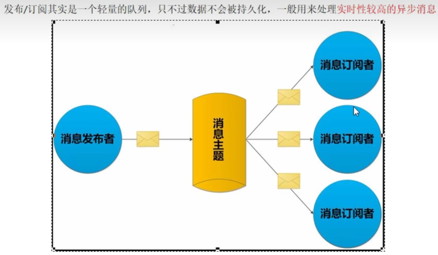

[toc]
# 1 介绍
是一种消息通信模式:发送者(PUBLISH)发送兴息，订阅者(SUBSCRIBE)接收消息，可以实现进程间的消息传递
Redis可以实现消息中间件MQ的功能，通过发布订阅实现消息的引导和分流。
Redis客户端可以订阅任意数量的频道,类似我们微信关注多个公众号


# 2 订阅
推荐先订阅后再发布，订阅成功之前发布的消息是收不到的
```shell
# 订阅一个或多个符合给定模式的频道（批量订阅）
psubscribe pattern [pattern ...]
```
其中pattern中`*`表示任意多个字符， `?`表示任意单个字符
```shell
# 订阅以`c`开头的全部channel和以`a`开头的2个字符的全部channel
psubscribe c* a?
```


```shell
# 订阅给定的一个或多个频道
subscribe channel [channel ...]
```
订阅的客户端每次可以收到3个参数信息的消息：消息种类、始发频道名称、实际消息内容


# 2 发布信息到指定频道
```shell
PUBLISH channel message
```
**参数**:
- <font color=red>channel</font>: 指定的频道名称
- <font color=red>message</font>: 消息内容

# 3 查看发布订阅系统的状态
```shell
# 查看由活跃频道组成的列表
PUBSUB CHANNELS

# 查看某个频道有几个订阅者
PUBSUB NUMSUB [channel ...]

# 只统计使用PSUBSCRIBE命令执行的，返回客户端订阅的唯一模式数量
PUBSUB NUMPAT 
```

# 4 退订频道
```shell
# 退订指定的频道
unsubscribe channel [channel ...]

# 退订指定模式的频道
punsubscribe pattern [pattern ...]
```

# 5 消息发布订阅的缺点
- 发布的消息在Redis系统中不能持久化，因此，必须先执行订阅，再等待消息发布。如果先发布了消息，那么该消息由于没有订阅者，消息将会丢失
- 消息只管发送对于发布者而言消息是即发即失的，不管接收，也没有ACK机制，无法保证消息的消费成功。
- 以上的缺点导致Redis的Pub/Sub模式就像个小玩具，在生产环境中几乎无用武之地，为此Redis5.0版本新增了Stream数据结构，不但支持多播，还支持数据持久化，相比Pub/Sub更加的强大