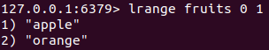
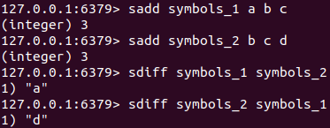
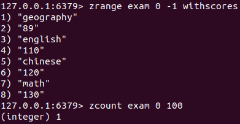
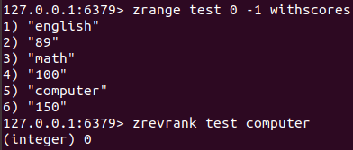

[toc]
# 1 Redis类型分类
Redis的类型分为string、hash、list、set、sorted_set五种基本类型。此外还有一些高级类型像Bitmaps、HyperLogLog、GEO.
**string**: 存储字符串的key-value键值对。

**hash**：key对应的不再是一个value, 而是一个数据结构。即一个key中保存了多对键值对数据。底层使用哈希表结构实现数据存储。

**list**:存储列表信息，一个key中可以存储多个value，通过数据可以体现数据的先后顺序，底层使用双向链表实现。

**set**：储存集合信息，一个key中包含多个value,适合存储大量数据，在查询方面能提供更高的效率。set中的值不允许重复。
底层存储结构与hash相同，但仅存储键，不存储值(nil)。

**sorted_set**：类似set数据类型，但sorted_set类型可以保存可排序数据。底层存储在set的基础上添加了可排序字段score.

其中score是用于排序，不是数据

-------------------------------------
# 2 string类型
string是Redis中的数据格式之一。是通过key-value的方式存储的。
## 2.2 string的操作命令
### 2.2.1 添加/修改数据
**添加/修改单个数据**
<table><tr><td bgcolor="#87CEFA"></br>

```shell
set key value
```
</td></tr></table>
将key对应的值设置为value, 该命令可以用于添加或修改string类型的key对应的value.
_示例_：

```shell
set name jake # 设置name的值为jake
```
_结果_：
<table><tr><td bgcolor="black">
<font color=white>
127.0.0.1:6379> set name jake</br>
OK</br>
127.0.0.1:6379> set age 25</br>
OK</br>
</font>
</td></tr></table>


**添加/修改多个数据**
<table><tr><td bgcolor="87CEFA"></br>

```shell
mset key1 value1 key2 value2 ...
```
</td></tr></table>

_示例_：
<table><tr><td bgcolor="black">
<font color=white>
127.0.0.1:6379> mset SongName ConfessionBallon signer JayChou</br>
OK</br>
</font>
</td></tr></table>

### 2.2.2 获取数据
**获取单个数据**
<table><tr><td bgcolor="87CEFA"></br>

```shell
get key # 获取key对应的值
```
</td></tr></table>

**注意1**：如果没有对应的key，则输出(nil)
_示例_：
```shell
get name # 获取name对应的值
```
_结果_：
<table><tr><td bgcolor="black">
<font color=white>
127.0.0.1:6379> get name </br>
"jake"</br>
127.0.0.1:6379> get apple</br>
(nil)</br>
</font>
</td></tr></table>


**获取多个数据**
<table><tr><td bgcolor="87CEFA"></br>

```shell
mget key1 key2 key3 ...
```
</td></tr></table>

_示例_：
<table><tr><td bgcolor="black">
<font color=white>
127.0.0.1:6379> mget SongName singer</br>
&nbsp 1) "ConfessionBallon"</br>
&nbsp 2) "JayChou"</br>
</font>
</td></tr></table>

### 2.2.3 删除数据
<table><tr><td bgcolor="87CEFA"></br>

```shell
del key # 删除string类型key对应的value
```
</td></tr></table>

**tips**：
1. del 命令后面可以接多个key, 每个key用空格分开
_示例_：
<font color=Gray>返回的(integer)2说明成功删除了2个key, 如果输出的是(integer)0说明没有删除任何key(一般是没有对应的key)</font>
2. del命令还可以删除string、hash、set、list、sorted_set类型

<table><tr><td bgcolor="black">
<font color=white>
127.0.0.1:6379> del name age</br>
(integer) 2</br>
</font>
</td></tr></table>

### 2.2.4 获取数据字符个数
<table><tr><td bgcolor="#87CEFA"></br>

```shell
strlen key # 获取key对应的字符串长度
```
</td></tr></table>

_示例_：
<font color=Gray>一个ASCCI码的长度算1。对于中文，一个字3字节。<font>

<table><tr><td bgcolor="black">
<font color=white>
127.0.0.1:6379> get SongName</br>
"ConfessionBallon"</br>
127.0.0.1:6379> strlen SongName</br>
(integer) 16</br>
127.0.0.1:6379> set singer 周杰伦</br>
OK</br>
127.0.0.1:6379> strlen singer</br>
(integer) 9</br>
</font>
</td></tr></table>

### 2.2.5 追加信息到原始值后面
<table><tr><td bgcolor="#87CEFA"></br>

```shell
append key value # 将value添加到原本key的值的后面
```

</td></tr></table>

_示例_:
<font color=Gray>append命令的输出(integer) 20表示追加字符后新的字符的长度（字节）。</font>
<table><tr><td bgcolor="black">
<font color=white>
127.0.0.1:6379> get SongName</br>
"ConfessionBallon"</br>
127.0.0.1:6379> append SongName " Key"</br>
(integer) 20</br>
127.0.0.1:6379> get SongName</br>
"ConfessionBallon Key"</br>
</font>
</td></tr></table>

### 2.2.6 string数字自增
```shell
# 将key的值加1，前提是key的值是整数，不然回失败
incr key
```

<table><tr><td bgcolor="black">
<font color=white>
127.0.0.1:6379> get number</br>
"2"</br>
127.0.0.1:6379> incr number</br>
(integer) 3</br>
127.0.0.1:6379> get number</br>
"3"</br>
</font>
</td></tr></table>

### 2.2.7 string数字加减指定数字
```shell
# 将key的值加value，前提是key的值是整数，不然回失败
# 当value是负数是则为减
incrby key value
```

<table><tr><td bgcolor=black>
<font color=white>
127.0.0.1:6379> incrby number 2</br>
(integer) 5</br>
</font>
</td></tr></table>

### 2.2.8 给字符数字增/减浮点数

```shell
# 给key字符串的值增加value(浮点数)
# 当value为负数时，表示减去
incrbyfloat key value
```

<table><tr><td bgcolor="black">
<font color=white>
127.0.0.1:6379> incrbyfloat num 2.3</br>
"4.6"</br>
</font>
</td></tr></table>


### 2.2.9 setnx
setnx在设置string的时候，如果key存在则回设置失败，如果key不存在则设置成功。
<table><tr><td bgcolor="black">
<font color=white>
# num存在</br>
127.0.0.1:6379> setnx num 2</br>
(integer) 0</br>
# num1不存在</br>
127.0.0.1:6379> setnx num1 2</br>
(integer) 1</br>
</font>
</td></tr></table>


---------------------------------------------
# 3 Hash类型

## 3.1 Hash操作命令
### 3.1.1 添加/修改数据
**添加/修改单个hash filed数据**
<table><tr><td bgcolor="#84CEFA"></br>

```shell
hset key field value # 设置/添加key中的field字段为value
```
</td></tr></table>

_示例_:
<table><tr><td bgcolor="black">
<font color=white>
127.0.0.1:6379> hset poseron name terry</br>
(integer) 1</br>
127.0.0.1:6379> hset person age 24</br>
(integer) 1</br>
</font>
</td></tr></table>

**添加/修改hash多个filed数据**
<table><tr><td bgcolor="#87CEFA"></br>

```shell
# 添加/修改hash多个filed数据
hmset key filed1 value1 filed2 value2...
```
</td></tr></table>

_示例_
<font color=Gray>设置person的name字段为jake, age字段为25</font>
<table><tr><td bgcolor="black">
<font color=white>
127.0.0.1:6379> hmset person name jake age 25</br>
OK</br>
</font>
</td></tr></table>

**仅添加不存在的hash filed信息，filed存在则不添加**
<table><tr><td bgcolor="#87CEFA"></br>

```shell
# 设置hash的key的filed为value,如果filed已经存在则会执行失败
hsetnx key filed value
```
</td></tr></table>

_示例_：
<font color=Gray>如果执行成功会输出"(integer) 1", 执行失败会输出
"(integer) 0". 示例中线设置name字段，但因为name字段已经存在，所以会执行失败。后面设置email字段成功</font>
<table><tr><td bgcolor="black">
<font color=white>
127.0.0.1:6379> hget person name</br>
"jake"</br>
127.0.0.1:6379> hsetnx person name terry</br>
(integer) 0</br>
127.0.0.1:6379> hsetnx person email 123@jake.com</br>
(integer) 1</br>
127.0.0.1:6379> hget person name</br>
"jake"</br>
127.0.0.1:6379> hget person email</br>
"123@jake.com"</br>
</font>
</td></tr></table>

### 3.1.2 获取数据
**获取hash的单个filed数据**
<table><tr><td bgcolor="#84CEFA"></br>

```shell
hget key filed # 获取hash key的filed字段的值
```
</td></tr></table>

_示例_:
<table><tr><td bgcolor="black">
<font color=white>
127.0.0.1:6379> hget person name</br>
"jake"</br>
127.0.0.1:6379> hget person age</br>
"25"</br>
</font>
</td></tr></table>

**获取hash的全部filed数据**
<table><tr><td bgcolor="87CEFA"></br>

```shell
hgetall key # 获取hash的key的全部filed信息
```
</td></tr></table>

_示例_：
<table><tr><td bgcolor="black">
<font color=white>
127.0.0.1:6379> hgetall person</br>
1) "age"</br>
2) "25"</br>
3) "name"</br>
4) "jake"</br>
</font>
</td></tr></table>

**获取hash指定的多个filed数据**
<table><tr><td bgcolor="#87CEFA"></br>

```shell
# 获取hash指定的filed1 filed2...数据
hmget key filed1 filed2 ...
```
</td></tr></table>

_示例_：
获取hash person下的name和age字段的值
<table><tr><td bgcolor="black">
<font color=white>
127.0.0.1:6379> hmget person name age</br>
1) "jake"</br>
2) "25"</br>
</font>
</td></tr></table>


### 3.1.3 删除hash数据
<table><tr><td bgcolor="#87CEFA"></br>

```shell
# 删除hash key的filed1,filed2...字段
hdel key filed1 filed2 ... 
```
</td></tr></table>

_示例_：
返回的数字是成功删除的字段的个数, 由于person中没有sex字段，因此只删除了age，email字段两个字段。
<table><tr><td bgcolor="black">
<font color=white>
127.0.0.1:6379> hdel person age email sex</br>
(integer) 2</br>
</font>
</td></tr></table>

### 3.1.4 获取hash表中键值对的数量
<table><tr><td bgcolor="#87CEFA"></br>

```shell
# 获取hash表key中键值对的数量
hlen key
```
</td></tr></table>

_示例_：
<table><tr><td bgcolor=black>
<font color=white>
127.0.0.1:6379> hlen person</br>
(integer) 2</br>
</font>
</td></tr></table>

### 3.1.5 判断hash表中是否存在指定字段
<table><tr><td bgcolor="#87CEFA">

```shell
# 判断hash表key中是否存在指定字段filed
hexists key filed
```
</td></tr></table>

_示例_：
<table><tr><td bgcolor=black>
<font color=white>
127.0.0.1:6379> hexists person name</br>
(integer) 1</br>
127.0.0.1:6379> hexists person email</br>
(integer) 0</br>
</font>
</td></tr></table>


### 3.1.6 获取hash表中所有的key
<table><tr><td bgcolor="#87CEFA"></br>

```shell
# 获取hash表中所有的key
hkeys key
```
</td></tr></table>

_示例_：
<table><tr><td bgcolor=black>
<font color=white>
127.0.0.1:6379> hkeys person</br>
1) "name"</br>
2) "age"</br>
</font>
</td></tr></table>

### 3.1.7 获取hash表中所有字段的值
<table><tr><td bgcolor="#87CEFA"></br>

```shell
# 获取hash表中所有字段的值
hvals key
```
</td></tr></table>

_示例_：
<table><tr><td bgcolor=black>
<font color=white>
127.0.0.1:6379> hvals person</br>
1) "jake"</br>
2) "25"</br>
</font>
</td></tr></table>

### 3.1.8 设置hash指定字段的数值数据增加指定大小
**设置int类型的数据增加指定大小**
<table><tr><td bgcolor="#87CEFA"></br>

```shell
# 获取hash表key中的key字段的值增加increment的大小
hincrby key filed increment
```
</td></tr></table>

_示例_：
如果increment的大小为负数则表示'减去'
<table><tr><td bgcolor=black>
<font color=white>
127.0.0.1:6379> hget person age</br>
"25"</br>
127.0.0.1:6379> hincrby person age -10</br>
(integer) 15</br>
127.0.0.1:6379> hget person age</br>
"15"</br>
</font>
</td></tr></table>

**注意**:
1.如果没有这个字段或者key，则会创建它并赋值为increment.
2. 如果filed字段不是int类型会执行失败
  <table><tr><td bgcolor=black>
  <font color=white>
   127.0.0.1:6379> hincrby person name 1</br>
  (error) ERR hash value is not an integer</br>
  </font>
  </td></tr></table>


**设置float类型的数据增加指定大小**
<table><tr><td bgcolor="#87CEFA"></br>

```shell
# 获取hash表key中的key字段的值增加increment的大小
hincrbyfloat key filed increment
```
</td></tr></table>

_示例_：
<table><tr><td bgcolor=black>
<font color=white>
127.0.0.1:6379> hget person score</br>
"3.14"</br>
127.0.0.1:6379> hincrbyfloat person score 3.14</br>
"6.28"</br>
</font>
</td></tr></table>
注意事项同hincrby命令</br>
1. 对于数据的实际值是整数，可以使用hincrbyfloat来操作，但如果操作过后，数值变为了小数，则不能再使用incrby来操作

## 3.2 Hash类型原理
### 3.2.1 hash类型底层存储
hash类型的key对应的不是一个value, 而是一个数据结构。即一个key中保存了多对键值对数据，类似于C/C++的结构体。底层使用哈希表结构实现数据存储。

### 3.2.2 hash类型数据操作注意事项
- hash类型下的value只能存储字符串，不允许存储其他数据类型，不存在嵌套现象。
- 每个hash可以存储(2^32)-1个键值对
- hash类型十分贴近对象的数据存储形式，并且灵活添加/删除对象的属性。但hash的设计之初并不是为了存储大量对象而设计的，切记不可来滥用，更不可将hash作为对象列表使用。
- hgetall命令可以获取hash key的全部filed, 如果内部的filed过多，遍历整体数据效率就会很低，有可能成为数据访问瓶颈。

-----------------------------------------------
# 4 List类型
## 4.1 list类型操作命令
### 4.1.1 添加list数据
**从list的左边push数据**
<table><tr><td bgcolor="#87CEFA"></br>

```shell
# 将数据从list的左边push进去
lpush key value1 value2 ...
```
</td></tr></table>

**示例**：
通过lpush进去的数据在内部的排列顺序为: orange,apple

对于通过`lpush`对各数据到指定key中时，是一次从左到右push数据。例如上面的命令push到fruits中的数据实际排列顺序为`orange apple`,这是因为先push了`apple`，然后再在list的左边push了`orange`。因此`orange`在list的最左边。

**从list的右边push数据**
<table><tr><td bgcolor="#87CEFA"></br>

```shell
# 将数据从list的右边push进去
rpush key value1 value2 ...
```
</td></tr></table>

**示例**：
通过lpush进去的数据在内部的排列顺序为: apple,orange


### 4.1.2 获取list数据
**获取指定list key索引范围内的value**
<table><tr><td bgcolor="#87CEFA"></br>

```shell
#返回索引在区间[start,stop]的数据
lrange key start stop
```
</td></tr></table>

**示例**：
<font color=Gray>返回list fruits索引在[0,1]区间内的value</font>

**注意**：
- 如果tart/stop参数为负数，代表是倒数的第start/stop的索引像lrange fruits 0 -1代表返回fruits list中的全部value信息。

**获取指定索引下的value**
 <table><tr><td bgcolor="#87CEFA"></br>

```shell
#返回指定索引的数据，没有这返回空(索引从0开始)
lindex key index
```
</td></tr></table>

**示例**：
<font color=Gray>如果index下没有value则返回(nil)</font>


**注意**：
1. 如果index的-1，则返回最后一个的数据，-2表示倒数第2个，以此类推。

### 4.1.3 获取list中的元素的个数
<table><tr><td bgcolor="#87CEFA"></br>

```shell
llen key
```
</td></tr></table>

**示例**：


### 4.1.4 获取并移除list中的数据
**获取并移除list key中最左边的一个元素**
<table><tr><td bgcolor="#87CEFA"></br>

```shell
lpop key
```
</td></tr></table>

**示例**：
<font color=Gray>初始时fruits中包含values(apple,orange,watermenoon),移除左边的一个元素后变成了(orange,watermenoon)</font>
.

**获取并移除list key中最右边的一个元素**
<table><tr><td bgcolor="#87CEFA"></br>

```shell
rpop key
```
</td></tr></table>

**示例**：
<font color=Gray>初始时fruits中包含values(apple,orange,watermenoon),移除右边的一个元素后变成了(apple,orange)</font>


**阻塞获取并删除数据**
<table><tr><td bgcolor="#87CEFA"></br>

```shell
# 获取并删除key中最左边的数据，如果没有获取到数据就阻塞直到timeout秒
blpop key timeout

# 从key的右边阻塞获取并删除一个value
brpop key timeout
```
</td></tr></table>

**示例**：
<font color=Gray>在一个key的values为空的list中执行blpop,并设置超时时间为12秒，在timeout时间内，另一个redis客户端2上执行lpush name jjj. 然后客户端1就可以获取到name中的值了</font>


### 4.1.5 删除指定数量的数据
<table><tr><td bgcolor="#87CEFA"></br>

```shell
# 将链表key中的count个value移除（从左开始计数）。如果count是负数则表示从右移除count个value值
#
lrem key count value
```
</td></tr></table>

**示例**
<font color=Gray>起始中fruits中有数据(apple,orange,apple,watermenoon,apple), 从右边开始删除2个apple数据后，fruits中的数据变成了(apple,orange,watermenoon)</font>


### 4.1.6 list截取
<table><tr><td bgcolor="#87CEFA"></br>

```shell
# 截取key中索引为[start,stop]范围的value并赋值给原key
# start/stop可以是负数，代表从右边数第|start/stop|个
ltrim key start stop
```
</td></tr></table>

**示例**：
<font color=Gray>起始列表fruits中包含数据(apple,orange,watermenoon), 截取索引区间[1,2]后，fruits中的值变成了(orange,watermeoon)</font>


### 4.1.7 更新list数据
<table><tr><td bgcolor="#87CEFA"></br>

```shell
# 将key中索引为index的数据设置为value
lset key index value
```
</td></tr></table>

**示例**：
<font color=Gray>起始fruits中的数据为(watermenoon,apple)，将索引为1的数据修改后变成了(watermenoon,orange)</font>


<font color=Gray>如果index超出了列表的范围会执行失败</font>


### 4.1.8 插入list数据
<table><tr><td bgcolor="#87CEFA"></br>

```shell
# 向key中的值为pivot的前/后面插入一个值value(靠近左边的为前，靠近右边的为后)。
linsert key before|after pivot value
```
</td></tr></table>

**示例**：
<font color=Gray>起始fruits中的数据为(apple,watermenoon,apple)，在watermenoon的前面插入wabibabo后变成了(apple,wabibabo,watermenoon,orange)</font>


## 4.2 list使用中的注意事项
- list中保存的数据都是string类型，数据总容量是有限的，最多(2^32)-1 = 4294967295
- list具有索引概念，但是操作数据时通常以队列的形式进行入队出队操作，或以栈的形式进行入栈出栈操作
- 获取全部数据操作结束索引设置为-1
- list可以对数据进行分页操作，通常第一页的信息来自于list,第二页以及更多的信息通过数据库的形式加载
## 4.3 list底层存储结构
存储列表信息，一个key中可以存储多个value，通过数据可以体现数据的先后顺序，底层使用双向链表实现。


-------------------------------------------------
# 5 Set类型
## set操作命令
### 5.1.1 向set中添加数据
<table><tr><td bgcolor="#87CEFA"></br>

```shell
sadd key member1 member2 ...
```
</td></tr></table>

**示例**：
<font color=Gray>向集合symbols中添加数据(s,d,a)</font>


### 5.1.2 获取set中的全部数据
<table><tr><td bgcolor="#87CEFA"></br>

```shell
smembers key
```
</td></tr></table>

**示例**：


### 5.1.3 删除set中的数据
<table><tr><td bgcolor="#87CEFA"></br>

```shell
srem key member1 member2 ...
```
</td></tr></table>

**示例**：


### 5.1.4 获取集合数据的总量(按个)
<table><tr><td bgcolor="#87CEFA"></br>

```shell
scard key
```
</td></tr></table>

**示例**:
<font color=Gray>获取到scard中的元素个数为4个。</font>


### 5.1.5 判断集合中是否包含指定member
<table><tr><td bgcolor="#87CEFA"></br>

```shell
sismember key member
```
</td></tr></table>

**示例**:
<font color=Gray>如果返回"(integer) 1"说明集合中存在执行的member, 返回"(integer) 0"说明不存在。</font>


### 5.1.6 随机获取并移除set中的n个成员
<table><tr><td bgcolor="#87CEFA"></br>

```shell
spop key number
```
</td></tr></table>

**示例**：
<font color="Gray">随机获取并移除set中的两个元素</font>


### 5.1.7 求两个set的交集
**仅输出set求交集的结果**
<table><tr><td bgcolor="#87CEFA"></br>

```shell
# 求key1,key2,key3的交集
sinter key1 key2 key3 ...
```
</td></tr></table>

**示例**：


**求交集的结果并存入另一个集合**
<table><tr><td bgcolor="#87CEFA"></br>

```shell
# 求key1,key2...的交集，并将结果保存在dest中
sinterstore dest key1 key2 ...
```
</td></tr></table>

**示例**：
<font color=Gray>设置集合symbols_1(a,b,c)、symbols_2(b,c,d). 这2个集合的交集(b,c)存入dest中</font>


### 5.1.8 求set的并集
**仅输出求并集的结果**
<table><tr><td bgcolor="#87CEFA"></br>

```shell
# 求key1,key2...的并集
sunion key1 key2 ...
```
</td></tr></table>

**示例**：
<font color=Gray>设置集合symbols_1(a,b,c)、symbols_2(b,c,d)、symbols_3(b,c,x). 这3个集合的并集为(a,b,c,d,x)</font>


**求并集，将结果存入dest**
<table><tr><td bgcolor="#87CEFA"></br>

```shell
# 求key1,key2...的并集
sunionstore dest key1 key2 ...
```
</td></tr></table>

**示例**：
<font color=Gray>设置集合symbols_1(a,b,c)、symbols_2(b,c,d)、symbols_3(b,c,x). 这3个集合的并集(a,b,c,d,x)存入dest. 如果dest不存在就创建；如果dest中有数据则覆盖；如果dest是其他类型则删除原先的值并改为set类型，在将结果添加进去</font>


### 5.1.9 求集合set的差集
**仅将set求差集的结果输出**
<table><tr><td bgcolor="#87CEFA"></br>

```shell
# 求key1,key2,key3 ...的差集,key1-key2-key3 
sdiff key1 key2 key3 ...
```
</td></tr></table>

**示例**：


**将set求差集的结果存入dest**
<table><tr><td bgcolor="#87CEFA"></br>

```shell
# 求key1,key2,key3 ...的差集(key1-key2-key3) 并存入dest
sdiffstore dest key1 key2 key3 ...
```
</td></tr></table>

**示例**：


------------------------------------------
### 5.1.10 移动set元素到另一个set
<table><tr><td bgcolor="#87CEFA"></br>

```shell
# 将source中的member元素移动到dest中
smove source dest member
```
</td></tr></table>

**示例**：
<font color=Gray>初始时set symbols_1(a,b,c), symbols_2(b,c,d). 将symbols_1中的元素a移动到symbols_2中后:  symbols_1(b,c), symbols_2(a,b,c,d).</font>


## set类型操作注意事项
- set类型不允许数据重复，如果添加的数据在set中已经存在，则只保留一份。
- set虽然于hash的存储结构相同，但无法启用hash中存储值的空间。

-----------------------------------------------
# 6 sorted_set类型
sorted_set类型是在set类型的基础上为每个member添加了score字段，用于对member进行排序。
## 6.1 sorted_setl类型操作命令
### 6.1.1 添加数据
<table><tr><td bgcolor="#87CEFA"></br>

```shell
# 向key中添加成员member1, member1的score为score1
zadd key score1 member1 score2 member2...
```
</td></tr></table>

**示例**：
<font color=Gray>向sorted_set exam中添加math,chinese成员，它们的score分别为123,100</font>


### 6.1.2 查看数据
#### 6.1.2.1 zrange
**根据索引来查看数据，以score的升序来进行排序，即索引为0的score是最小的**
<table><tr><td bgcolor="#87CEFA"></br>

```shell
# 查看key中索引为[start,stop]的成员，以score升序排列.
# 如果添加withscores参数，还会输出对应成员的score
zrange key start stop [withscores]
```
</td></tr></table>

**示例**：
<font color=Gray>获取exam中的全部成员，-1代表索引最后一位。</font>


<font color=Gray>获取exam中的全部成员，同时输出对应的score信息。成员chinese的score为100，成员math的score为123。</font>


#### 6.1.2.2 zrevrange
**根据索引来查看数据，以score的降序来进行排序，即索引为0的score是最大的**
<table><tr><td bgcolor="#87CEFA"></br>

```shell
# 查看key中索引为[start,stop]的成员,按score降序.
# 如果添加withscores参数，还会输出对应成员的score
zrevrange key start stop [withscores]
```
</td></tr></table>

**示例**：
<font color=Gray>获取exam中的全部成员，-1代表索引最后一位。</font>


<font color=Gray>获取exam中的全部成员，同时输出对应的score信息。成员chinese的score为100，成员math的score为123。</font>


#### 6.1.2.3 zrangebyscore
**按score条件获取数据，结果为升序**
<table><tr><td bgcolor="#87CEFA"></br>

```shell
# 获取score在[min,max]区间的数据
# withscores参数表示同时获取member的score
# limit offset count表示从第offset个开始获取count个
zrangebyscore key min max [withscores] [limit offset count]
```
</td></tr></table>

**示例**：
<font color=Gray>获取exam中score在范围[120,150]的数据，取其中的2个，从偏移量为1处开始获取。
因为exam中满足score在[120,150]的数据有3个，按**升序**排列为(chinese(120),math(130),biology(140)), 偏移为1的是math, 最多取两个member，因此输出结果为(math(130),biology(140)).</font>


#### 6.1.2.4 zrevrangebyscore
**按score条件获取数据，结果为降序**
<table><tr><td bgcolor="#87CEFA"></br>

```shell
# 获取score在[max,min]区间的数据
# withscores参数表示同时获取member的score
# limit offset count表示从第offset个开始获取count个(包括offset)
zrevrangebyscore key max min [withscores] [limit offset count]
```
</td></tr></table>

**示例**：
<font color=Gray>获取exam中score在范围[130,100]的数据，取其中的1个，从偏移量为0处开始获取。
因为exam中满足score在[130,100]的数据有3个，按**降序**排列为(math(130),chinese(120),english(110)), 偏移为0的是math, 最多取1个member，因此输出结果为(math(130))).</font>


### 6.1.3 删除sorted_set成员
#### 6.1.3.1 zrem
**删除sorted_set中的元素**
<table><tr><td bgcolor="#87CEFA"></br>

```shell
# 删除key中的member1、menber2成员
zrem key member1 member2 ...
```
</td></tr></table>

**示例**：
<font color=GRAY>删除exam中的math,chinese,english成员，因为exam中没有english成员，因此忽略english。 并且输出的(integer)2表示成功删除2个成员。</font>


#### 6.1.3.2 zremrangebyrank
**根据索引范围删除sorted_set中的元素**
<table><tr><td bgcolor="#87CEFA"></br>

```shell
# 删除按score升序排列的key中索引在[start,stop]区间的member
zremrangebyrank key start stop
```
</td></tr></table>

**示例**：
<font color=GRAY>起始exam按score的升序排列元素为(english,chinese,math,biology), 因为删除了索引在[1,2]之间的(chinese,math), 因此剩余(english,biology).</font>


#### 6.1.3.3 zremrangebyscore
**根据score范围删除sorted_set中的元素**
<table><tr><td bgcolor="#87CEFA"></br>

```shell
# 删除按score升序排列的key中score在[min,max]区间的member
zremrangebyscore key min max
```
</td></tr></table>

**示例**：
<font color=GRAY>起始exam按score的升序排列元素为(english(110),chinese(120),math(130),biology(140)), 因为删除了score在[125,140]之间的(math(130),biology(140)), 因此剩余(english(110),chinese(120)).</font>


### 6.1.4 获取sorted_set中的元素个数
**获取sorted_set中全部元素的个数**
<table><tr><td bgcolor="#87CEFA"></br>

```shell
zcard key
```
</td></tr></table>


**获取sorted_set中指定score区间的元素的个数**
<table><tr><td bgcolor="#87CEFA"></br>

```shell
# 获取key中score在[min,max]区间的元素个数
zcount key min max
```
</td></tr></table>

**示例**：


### 6.1.5 sorted_set求交集
<table><tr><td bgcolor="#87CEFA"></br>

```shell
# 将key1,key2...求交集，其中相同的元素的score相加，结果存入dest中。numkeys是后面接的key的个数
zinterstore dest numkeys key1 key2 ...
```
</td></tr></table>

**示例**：
<font color=Gray>求test与exam的交集，并将score相加</font>


<font color=Gray>如果在zinterstore命令中添加**aggregate max**可以在进行合并时，score取最大值</font>


<font color=Gray>如果在zinterstore命令中添加**aggregate min**可以在进行合并时，score取最小值</font>


### 6.1.6 获取数据对应的索引
#### 6.1.6.1 zrank
**以score的升序排列，获取指定成员的索引**
<table><tr><td bgcolor="#87CEFA"></br>

```shell
# 获取member对应的所以，(获取排名)。如果不存在成员则返回(nil)
zrank key member
```
</tr></td></table>

**示例**：
<font color=Gray>获取到math的索引为1</font>


#### 6.1.6.2 zrevrank
**以score的降序排列，获取指定成员的索引**
<table><tr><td bgcolor="#87CEFA"></br>

```shell
# 获取member对应的所以，(获取排名)。如果不存在成员则返回(nil)
zrevrank key member
```
</tr></td></table>

**示例**：
<font color=Gray>以降序排列，获取到math的索引为0</font>


### 6.1.7 sorted_set成员score值的获取
<table><tr><td bgcolor="#87CEFA"></br>

```shell
# 获取member的score值，如果member不存在则返回(nil)
zscore key member
```
</td></tr></table>

**示例**:


### 6.1.8 sorted_set的成员的score值修改
<table><tr><td bgcolor="#87CEFA"></br>

```shell
# 将key的member成员的score增加incremement, incremement可以为负数--表示减少
zincrby key incremement member
```
</td></tr></table>

**示例**：
<font color=Gray>将exam的math的score增加12</font>


## 6.2 sorted_set使用的注意事项
- scor保存的数据空间是64位，如果是整数，则对应范围是-9007199254740992~9007199254740992
- score保存的数据也可以是一个双精度的double值，基于双精度浮点数的特征，可能会丢失精度，使用时需要谨慎
  
- sorted_set底层存储还是基于set结构的，因此数据不能重复，如果添加相同数据，score值将会反复被覆盖，保留最后一次修改的结果。(zadd可以用于修改score值)

# 7 单数据操作和多数据操作
我们在对数据进行操作的时候，会遇到单数据操作和多数据操作。像对string类型的set和mset。它们的区别就是set命令只能设置一对string类型的key-value，而mset可以设置多对key-value的组合。
```shell
set key value
mset key1 value1 key2 value2 ...
```
对于像这样的单数据操作和多数据操作之间如何做选择，可以从效率的角度来思考。
首先我们来看一下一条指令是如何从redis客户端传输到redis服务端执行的。

1. Redis客户端发送指令到Redis服务器。
2. Reids服务执行命令。
3. Redis服务器将执行结果发送回Redi客户端。</br>

这3个步骤都会消耗时间，如果是3条指令以单指令的方式执行，那么指令在发送到Redis服务器和返回的步骤会执行3x2=6次，执行次数3次。
如果这3条指令以多指令发送，那么3条指令的往返次数就是2次. 执行次数3次。
这样看来似乎是多指令效率更高，但虽然多指令下数据传输的次数变少了，但数据量也变大了，单次传输的时间会更长。因此使用单指令还是多指令需要权衡指令量与传输时长的关系。一般要set的数据多的话用多指令更好，数据量较少使用单指令。

# 7 各个基本类型之间的转化(实践)
## 7.1 其他类型转化为string类型
其他所有基本类型后类型可以转化为string类型，转化后原本类型中的数据会丢失。
但string类型不能转化为其他数据类型
**示例**：
<table><tr><td bgcolor=black>

```shell
# 设置一个list类型
127.0.0.1:6379> lpush myType name age
(integer) 2
# myType的类型是list
127.0.0.1:6379> type myType
list

# 使用set命令设置与list的同名key
127.0.0.1:6379> set myType jake
OK
# 发现myType的类型变为了string
127.0.0.1:6379> type myType
string
# 试图对myType执行lpush操作但是失败
127.0.0.1:6379> lpush myType name age
(error) WRONGTYPE Operation against a key holding the wrong kind of value
```
</td></tr></table>

## 7.2 string与set/sorted_set类型
在一些情况下string类型可以变为set/sorted_set类型。即通过`zinterstore`命令，将两个sorted_set进行交集处理后存储到string类型的key中，那么这个key就会变成sorted_set（zset）l类型
```shell
# 起始，target为string类型
127.0.0.1:6379> type target
string
# 将两个zset类型求交集和结果存入target中
127.0.0.1:6379> zinterstore target 2 sc1 sc2
(integer) 1
# target的类型变为了zset
127.0.0.1:6379> type target
zset
```
此外有类似效果的redis命令还有：`zunionstore`