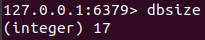

[toc]
# 1 数据库通用指令
## 1.1 删除指定的key
<table><tr><td bgcolor="97CEFA"></br>

```shell
# 删除指定的key1,key2...
del key1 key2 ...
```
</td></tr></table>

## 1.2 判断key是否存在
<table><tr><td bgcolor="97CEFA"></br>

```shell
# 判断key是否存在
exsits key
```
</td></tr></table>

<font color=Gray>如果存在返回"(integer) 1", 不存在返回"(integer) 0".</font>


## 1.3 获取key的类型
<table><tr><td bgcolor="97CEFA"></br>

```shell
# 获取key的类型
type key
```
</td></tr></table>

<font color=Gray>湖片区exam的类型位zset</font>


|   类型   |type的输出值|
|----------|-----------|
|string    |   string  | 
|list      |    list   |
|set       |    set    |
|hash      |    hash   |
|sorted_set|    zset   |

## 1.4 切换数据库
Redis有16个数据库，数据库之间的key互不影响，登录时默认是数据库0.
<table><tr><td bgcolor="97CEFA"></br>

```shell
# 切换数据库
select index
```
</td></tr></table>

<font color=Gray>切换数据库为2号索引数据库</font>


## 1.5 退出redis客户端
<table><tr><td bgcolor="97CEFA"></br>

```shell
# 退出redis客户端
quit
```
</td></tr></table>

**示例**：


## 1.6 检测与redis服务端通路是否正常
<table><tr><td bgcolor="97CEFA"></br>

```shell
# 检测与redis服务端通路是否正常
ping
```
</td></tr></table>

**示例**：
<font color=Gray>如果与redis服务器连通正常，会返回PONG. 如果不正常会返回对应的错误信息。</font>


## 1.7 数据在数据库之间移动
<table><tr><td bgcolor="97CEFA"></br>

```shell
# 将当前数据库的key移动到dbIndex数据库中
# 如果dbIndex数据库中存在key则会移动失败
move key dbIndex
```
</td></tr></table>

**示例**：
<font color=Gray>将msg0从0号数据库移动到3号数据库。</font>

<font color=Gray>移动失败会返回"(integer) 0"</font>


## 1.8 查询当前数据库中keys的数量
```shell
# 查询当前数据库中keys的数量
dbsize
```
</td></tr></table>

**示例**：


## 1.9 清空所有key
**清空当前db的所有key**
<table><tr><td bgcolor="#87CEFA"></br>

```shell
# 清空当前db的所有key
flushdb
```
</td></tr></table>

**示例**：


**清空所有db的所有key**
```shell
# 清空所有db的所有key
flushall
```
</td></tr></table>

**示例**：


## 1.10 设置key的有效时间
**设置key的有效时间长度**
<table><tr><td bgcolor="#87CEFA"></br>

```shell
# 设置key的有效时间长度，到时间后就清除，单位秒。
expire key second

# 设置key的有效时间长度，到时间后就清除，单位毫秒。
pexpire key second

#以UNIX 时间戳(unix timestamp)格式设置 key 的过期时间, 单位秒(通过time命令获取的输出的第一行数字就是UNIX时间戳的秒)
expireat key timestamp

# 以UNIX 时间戳(unix timestamp)格式设置 key 的过期时间，单位毫秒。
pexpireat key milliseconds-timestamp
```
</td></tr></table>

# 2 Redis功能性命令
## 2.1 清屏
<table><tr><td bgcolor="#87CEFA"></br>

```shell
# 清屏
clear
```
</td></tr></table>

## 2.2 帮助命令
<table><tr><td bgcolor="#87CEFA"></br>

```shell
# 查看对应命令的用法
help <命令名称>

# 查看对应组名下的命令有哪些。
# 组名包含 string、
help @组名
```
</td></tr></table>


