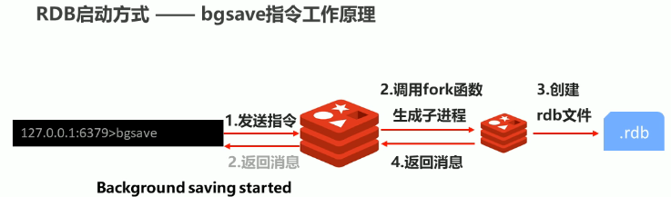

[toc]
# 1 持久化简介
Redis是一个内存数据库，即数据操作和存放是在内存中进行的，当断电/进程终止/宕机等时数据就会清空。为了避免数据丢失，需要一种机制将redis内存中的数据保存在永久性存储介质中，当重启时再读取数据恢复。 </br>
Redis持久化就是利用永久性存储介质将数据保存，在特定的时间将保存的数据进行恢复的工作机制。这可以防止数据意外丢失确保数据的安全性。 </br>
持久化有两种方式：
1. 对当前数据状态进行保存, 以快照的方式存储数据结果,存储格式简单，关注点在数据。这种方式称为数据快照(**RDB**)
2. 对数据的操作过程以日志的形式进行保存，恢复的时候再次执行该过程就可以得到数据。这种这种方存储格式复杂，关注数据操作过程，称为**AOF**.

# 2 RDB
## 2.1 RDB启动方式
### 2.1.1 save指令
<table><tr><td bgcolor="#87CEFA"></br>

```shell
# 为当前redis数据执行RDB
save
```
</td></tr></table>
save指令会将当前的redis数据以快照的方式保存到rdb文件中。</br>

**注意**: save指令的执行会阻塞当前redis服务器，直到当前RDB过程完成为止，有可能会造成长时间阻塞，线上环境不建议使用。

### 2.1.2 bgsave指令
为解决save指令会阻塞redis服务的问题，可以使用bgsave.
<table><tr><td bgcolor="#87CEFA"></br>

```shell
# 启动后台保存操作，但不立即执行.
bgsave
```
</td></tr></table>

**bgsave工作原理**:

在执行bgsave后，redis服务会调用fork生成子进程并创建rdb文件，并返回。由子进程执行RDB过程。

## 2.2 RDB相关的配置
<table><tr><td bgcolor=Black></br>

```shell
# 设置本地数据库文件名，该文件保存RDB数据，默认值为dump.rdb. 通常设置为dunp-端口号.rdb
# 这个文件会放在dir配置指定的文件夹下
dbfilename  dump.rdb

# 设置存储至本地数据库shivering是否压缩数据，默认为yes,采用LZF压缩
# 经验：通常认为开启状态，如果设置为no,可以节省CPU运行时间，但会使存储文件变大(巨大)
rdbcompression yes/no

# 设置是否进行RDB文件格式校验，该校验过程再写文件的读文件均进行
# 经验：通常为开启状态，如果设置为no，可以节约读写过程的约10%时间消耗，但是存储数据有一定损坏风险，
rdbchecksum yes/no

# 在使用bgsave指令后，在后台存储过程中如果出现错误现象，是否应该停止保存操作。
# 经验: 通常默认为开启
stop-writes-on-bgsave-error yes/no
```
</td></tr></table>

## 2.3 RDB的存储弊端
- 存储数据量较大，效率较低。
  基于快照的思想，每次读写都是全部数据，当数据量较大时，效率非常低。
- 大数据量下IO性能较低
- 基于fork创建子进程，内存产生额外消耗。
- 宕机带来的数据丢失风险

 **解决之法**
- 不写全数据，仅记录部分数据。
- 改变记录为记录操作过程。
- 对所有操作均进行记录。排除数据丢失的风险。

# 3 AOF
  基于RDB的弊端和解决之法，因此提出AOF（append only file）的概念：
  - 以地理日志的方式记录每次写命令，重启时再重新执行AOF文件中的命令达到恢复数据的目的。与EDB相比，可以简单描述为记录数据产生的过程。
- AOF的主要作用是解决了数据持久化的实时性，目前已经是Redis的持久化的主流方式。

## 3.1 AOF写数据过程
在Redis客户端将写命令发送到服务端时，会将这些命令存入缓存区，然后根据策略将缓存区中的命令写到AOF文件中。


**aof文件的内容格式**
以下是执行了set name jake; set age 23命令之后的aof文件内容：
<table><tr><td bgcolor=gray>
*2</br>
$6</br>
SELECT</br>
$1</br>
0</br>
*3</br>
$3</br>
set</br>
$4</br>
name</br>
$4</br>
jake</br>
*3</br>
$3</br>
set</br>
$3</br>
age</br>
$2</br>
23</br>
</td></tr></table>
其中'$'符号后面的数字代表下一行中有多少个字符，而下一行就是内容。

## 3.2 AOF写数据的三种策略
- always(每次):
  每次写入操作均同步到AOF文件中。这样做可以实现数据零误差，但性能较低。
- everysec（每秒）：
  每秒将缓冲区中的指令同步到AOF文件中，数据准确性较高，性能高，在系统宕机的情况下会最多丢失1秒的数据。everysec也是redis的默认配置。
- no(系统控制)：
  有操作系统控制每次同步到AOF文件的周期，整体过程不可控.
### 3.2.1 aways策略
使用always策略执行AOF时，当写命令发送到Redis服务器时。Redis服务会执行写命令，同时调用fork来创建子进程来将命令写入aof文件,这里的aof文件是没有重写的原始aof文件。


### 3.2.2 everysec策略
**基于everysec策略且未开启重写**
当接收到写命令时，会将启动fork启动一个子进程将命令写入aof缓存区中保存。当时间到达的时候，会将这个aof缓存区中的指令放到非重写的aof文件中。


**基于everysec策略且开启重写**
当AOF策略是everysec且开启了重写，执行写命令的时候，会创建子进程将写命令写入aof缓存区，等到时间到的时候写入aof文件，同时子进程还会将写明了存入aof重写缓存区中。
当执行bgrewriteaof命令进行重写的时候，bgrewriteaof命令会创建子进程去读取aof重写缓存区的数据，将它重写成新的aof临时文件，再用新的aof临时文件与原aof文件合并替换，再将临时aof文件删除。
**注意**：这里的执行bgrewriteaof命令是根据redis配置文件根据对应配置自动执行的。具体配置参考[3.4 AOF相关的配置](#34-aof相关的配置)


## 3.3 AOF重写
### 3.3.1 AOF重写概念
随着命令不断写入AOF，AOF文件也会越来越大，为解决这个问题，Reids引入了AOF重写机制来压缩文件的体积。AOF重写是将Reids**进程内**的数据转化为写命令同步到新AOF文件的过程。简单说就是将对同一个数据的若干个命令执行结果转化成最终结果数据对应指令的结果。
例如：有3条set命令依次执行set name jake; set name terry; set name tony;这3条set命令都对name进行了写操作，且最终name的值为tony, 执行AOF重写后就是将这3个set命令转换为set name tony这一条命令并写入AOF文件中。

### 3.3.2 AOF重写的作用
- 降低磁盘的占用量，提高磁盘效率。
- 体改持久化效率，减低持久化的写时间，提高IO效率。
- 在数据恢复时，提高数据恢复效率。

### 3.3.3 AOF重写规则
- 进程内已超时的数据不再写入文件。
- 忽略无效指令，重写时使用进程内数据直接生成，这样新的AOF文件只保留最终数据的写入命令。
- 对同一数据的多条写命令合并为1条命令。
  为防止数据量过大造成客户端缓存区溢出，对list,set,hash,sorted_set等类型，每条指令最多写入64个元素。

### 3.3.4 AOF手动重写命令
<table><tr><td bgcolor="#87CEFA"></br>

```shell
# 手动执行重写
bgrewriteaof
```
</td></tr></table>


## 3.4 AOF相关的配置
<table><tr><td bgcolor="gray"></br>

```shell
# 是否开启AOF功能,yes:开启，no:关闭。默认为no
appendonly yes|no

#AOF的策略选择
appendfsync always|everysec|no

# 存储AOF数据的文件名，存放在$(dir)配置的路径下
appendfilename <文件名>


# 自动重写触发条件配置
#--------------------------------------
# 执行自动重写bgrewriteaof命令的最小aof_current_size大小
# 当aof_current_size变量的大小大于等于配置的该值的话就重写
# aof_current_size是当前aof缓冲区的数据大小
# aof_current_size的值可以执行info Persistence命令查看(需要在配置文件中添加这个配置后才会有)
auto-aof-rewrite-min-size <size>

# 自动重写的百分比，当redis中百分比大于等于这个值时也发生重写
# 这个百分比的计算公式为
# (aof_current_size - aof-rewrite_min_size) / aof_base_size
# aof_base_size的值可以执行info Persistence命令查看(需要在配置文件中添加这个配置后才会有)
auto-aof-rewrite-percentage percent
```
</td></tr></table>

## 3.5 RDB与AOF的利弊


对于如何选用RDB和AOF可以参考以下几点：</br>
- 对数据非常敏感，建议使用默认的AOF持久化方案
  
  - AOF持久化策略使用everysec，每秒钟fsync一次，该策略redis人可以保持很好的处理性能。当出现问题时，最多丢失0~1秒内的数据。
  - 注意：由于AOF的文件较大，恢复起来就较慢
- 数据呈现阶段性有效性，建议采用RDB持久化方案

  - 数据可以良好做到阶段内无丢失（该阶段时开发者或运维人员手工维护的），且恢复速度较快，阶段点数据恢复通常采用RDB方案
  - 注意：利用RDB实现紧凑的数据持久化会使Redis性能降得很低
- 综合对比

  - RDB与AOF的选择实际上是在做一种权衡，每种都有利弊
  - 如不能承受数分钟以内的数据丢失，对业务数据非常敏感，选用AOF
  - 如能承受数分钟以内的数据丢失，且追求大数据集恢复速度，选用RDB
  - 灾难恢复选用RDB
  - 双保险策略：同时开启RDB和AOF,重启后，Reids优先使用AOF来恢复数据，降低数据丢失的量。
