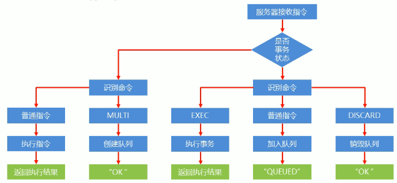

[toc]
# 1 Redis事务
有时候在使用redis执行一个操作时，会需要用到多个Redis命令的组合，如果其中任何一个命令执行失败都会无法完成操作。对于这类的操作，可以使用事务来实现。在一个事务内执行的多条命令，如果其中一条执行失败了，那么前面执行成功的命令也会回退至执行前的状态。
## 1.1 开启/执行事务命令
开启事务
<table><tr><td bgcolor="#87CEFA"></br>

```shell
# 设定事务开启的位置，该指令执行后，后续的所有指令均加入到事务中
multi
```
</td><tr></table>

执行事务
<table><tr><td bgcolor="#87CEFA"></br>

```shell
# 设定事务的结束位置，同时执行事务。与multi成对出现，成对使用。
exec
```
</td><tr></table>

**注意**：
1. 加入事务的命令暂时进入到任务队列中，并没有立即执行。只有执行exec命令才开始执行

## 1.2 取消事务
当事务过程中出现了问题，可以通过discard命令来取消事务
<table><tr><td bgcolor="#87CEFA"></br>

```shell
# 终止当前事务定义，发生在multi之后，exec之前
discard
```
</td></td></table>

**注意**：
1. 如果在事务定义的过程中，redis指令出现了语法错误，那么整体事务的所有命令就都不会执行。
2. 如果在事务定义过程中没有问题，但事务执行过程中发生了错误。比如对一个string类型的key进行lpush key value操作，该命令在事务定义过程中不会报错，但执行的时候会报错。但已执行完毕的指令对应的数据<font color=red>不会回退</font>至事务之前的状态（即使是在报错指令后面的指令也会继续执行）。这个时候需要程序猿在代码中实现回滚

## 1.3 事务工作流程


# 2 锁
## 2.1 事务锁
在多个客户端有可能同时操作同一组数据，并且该数据一旦被操作修改后，将不再适用继续操作。因此在操作这类数据前需要锁定，一旦数据发生变化，终止当前操作。
对此可以给key添加监视锁：
<table><tr><td bgvolor="#87CEFA"></br>

```shell
# 给key1,key2,key3...添加监视锁,在执行exec之前如果监视的key发生了变化，会清空事务列表。即使在监听的key发生改变后再向事务中添加命令，在执行exec时，事务列表中也还是会为空。
watch key1 key2 key3 ...

# 取消对所有key的监视
unwatch
```
</td></tr></table>

**注意**：
1. watch命令不能在事务定义中执行(执行multi之后，exec之前)
2. 一个watch命令仅对一个事务有效，如果在一个事务执行完之后，再开第二个事务，在第二个事务exec前，即使有其他redis客户端更改了最开始watch的key， 第二个事务也会执行成功。因此如果需要添加事务锁，在每次执行事务前都需要watch

## 2.2 分布式锁
对于2.1 事务锁中的watch是监听对应的key在执行事务前有没有变，若有变就终止一切操作。
但在另外一些场景中，我们需要锁定一些key，在我们释放之前，其他客户端不能修改对应的key。对此可以使用分布式锁。
利用setnx命令的返回值的特性---key有值则返回失败，没有值则返回成功 来设置一个公共锁lock-key
- 对于返回设置成功，拥有控制权，则进行下一步的操作
- 对于返回失败，不具有控制权，排队等待
- 操作完毕后使用del命令将lock-key给删除即可
<table><tr><td bgcolor="#87CEFA"></br>

```shell
# 如果lock-key有值返回失败，如果没有值返回成功
setnx lock-key value
```
</td></tr></table>

**注意**：
1. 像这种方式的分布式锁并不具备强制执行的特征，完全考各个redis客户端来遵守这样的规则。

## 2.3 死锁解决
依赖分布式锁的机制，如果有个redis客户端获取到锁后，在操作期间宕机，那么该如何解决呢？
由于锁操作由用户控制加锁解锁，必定会存在加锁之后未解锁的风险，因此需要解锁操作不能仅依赖用户控制，系统级别也要给出对应的保底处理方案。
对此可以对公共锁lock-key添加一个时间限制，到时不释放就自动放弃锁
<table><tr><td bgcolor="#87ECFA"></br>

```shell
# 给lock-key添加时间限制，second秒后自动清除
expire lock-kay <second>

# 给lock-key添加时间限制，milliseconds毫秒后自动清除
pexpire lock-key <milliseconds>
```
</td></tr></table>

由于操作通常都是微妙、毫秒级别的，因此锁的失效时长不宜设置得过大。具体时间需要业务测试后确认：
- 例如测试百万次最长执行时间对应的命令的最大耗时、测试百万次网络延迟平均耗时
- 锁时间设定推荐： 最大耗时*120% + 平均网络延时*110%
- 如果业务最大耗时远远大于网络平均延时，通常2个数量级，取其中耗时较长即可