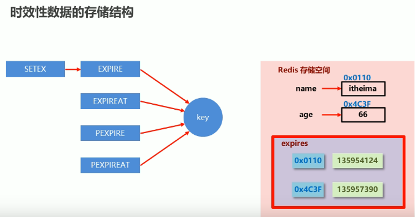
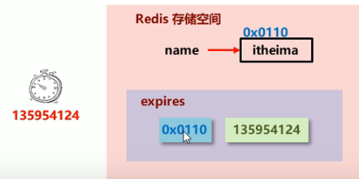
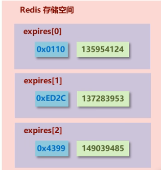

# 1 背景
Redis是一种内存级数据库，所有数据均存放在内存中，内存中的数据可以通过TTL指令获取其状态。
<table><tr><td bgcolor="#87CEFA"></br>

```shell
# 查看key的状态返回值:
# xx (具有时效性的数据剩余有效时间,单位：秒)，
# -1 (永久有效的数据)，
# -2 (已经过期的数据或被删除的数据或未定义的数据)
ttl key
```
</td></tr></table>

对于过期的数据，redis需要将它删除以避免内存占用，但redis不一定会马上删除。这是因为要考虑到如果当前进行的redis操作很频繁，CPU应该要优先处理重要的操作，而对于过期数据的删除可以缓一缓。
对于过期数据的删除是通过一定的策略来进行删除的
- 定时删除
  创建定时器，定时结束时，删除对应数据。
- 惰性删除
  数据有效时间结束时不做处理，等到下次再访问该数据时执行删除。
- 定期删除
  周期性轮询Redis的时效性数据，采用随机抽取的策略，利用过期数据占比的方式控制删除频度。

删除策略的目标并不是要将过期数据100%删除，而是要在内存占用与CPU占用之间寻找一种平衡，顾此失彼都会导致Redis的性能下降，甚至引发服务器宕机或内存泄漏。


# 2 时效性数据存储结构：

在学习删除策略之前，需要知道redis中的时效性数据是怎么存储的。
当我们通过[设置key的有效时间命令](3_Reids客户端的其他命令.md#110-设置key的有效时间)设置一个时效性数据时，会将数据的地址和对应的过期时间的键值对存放到expire缓冲区中，这是一个hash类型。删除策略主要是对这块区域的操作。


# 3 删除策略
## 3.1 定时删除
创建一个定时器，当key设置有过期时间，且过期时间到达时，由定时器任务立即执行对key的删除操作---删除对应key并且清除expire缓存区的对应key的数据。


**优点**：
- 节约内存，时间久删除，快速释放不必要的内存占用

**缺点**：
- CPU压力很大，无论CUP此时的负载有多高均会占用CPU，会影响redis服务器响应时间的指令执行吞吐量。

## 3.2 惰性删除
数据到达过期时间时不做处理，等到下次访问的时候才进行删除。
在获取数据命令之前redis内部都会调用expireIfNeeded()函数来判断数据是否过期。
**优点**：
- 节约CPU性能，发现必须删除的时候才会删除
**缺点**：
- 内存压力很大，如果过期的数据在后续很长时间都没有被访问过，那它将一直占用内存。
## 3.3 定期删除
定时删除和惰性删除是两个极端。定时删除CPU负载会很大，惰性删除内存压力大，那有没有折中的方案呢？有，可以使用定期删除。
**定期删除**：周期性轮询Redis的时效性数据，采用随机抽取的策略，利用过期数据占比的方式控制删除频度。
在Redis时效性expire数据存储空间中，存放了所有数据库中的时效性数据，如下图，expire[0]代表0号数据的时效性数据，expire[1]代表1号数据库的时效性数据。

**定期删除过程**：
1. redis启动服务器初始化时，会读取配置文件的server.hz的值，默认10.这个值可以在配置文件中通过hz来配置，并可以通过info server命令来查看server.hz的值。
    <table><tr><td bgcolor=Gray></br>

    ```shell
    # 定期删除策略中每秒会执行hz次serverCron()函数
    hz 10                        
    ```
    </td></tr></table>
2. 每秒钟会执行server.hz次<font color=red>serverCron()</font>函数,这个函数是对服务器的expire数据区进行轮询。<font color=red>serverCron() -> databasesCron() -> activeExpireCycle()</font>
3. <font color=red>serverCron()</font>中会执行<font color=red>databaseCron()</font>来对16个数据库依次进行访问。
4. 在<font color=red>databaseCron()</font>中会执行一个<font color=red>activeExpireCycle()</font>函数来对每一个expire[*]逐一进行检测，每次执行250ms / server.hz长度的时间。
检测时会<font color=red>随机</font>挑选W个key进行检测是否过期.
   - 如果过期就删除。
   - 如果一轮中删除的key的数量>W*25%，则循环该过程。
其中W的值是根据redis原码中ACTIVE_EXPIRE_SYCLE_LOOKUPS_PER_LOOP的值来的。<font color=blue>关于ACTIVE_EXPIRE_SYCLE_LOOKUPS_PER_LOOP的值，这里有疑问点！通过什么配置选项来决定的</font>

   - 如果一轮中删除的key的数量<=W*25%, 则检测下一个expire[*]，*为0-15循环。但*受db配置控制。
   - 期间有一个current_db用于记录<font color=red>activeExpireCycle()</font>轮询到哪一个expire[*]数据库了。当<font color=red>activeExpireCycle()</font>执行时间到期后，下次就从expire[current_db]开始继续往下执行。

**定期删除特点**
周期性轮询redis库中的时效性数据， 采用随机抽取的策略，利用过期数据占比的方式控制删除频度
**特点1**：CPU性能占用设置有峰值， 检测频度可自定义设置
**特点2**：内存压力不是很大，长期占用内存的冷数据会被持续清理
**总结**：周期性抽查存储空间(随机抽查，重点抽查)

**删除策略比对**
1.定时删除 (节约内存，无占用)（不分时段占用CPU资源， 频度高）（拿时间换空间） 
2.惰性删除（内存占用严重）（延时执行， CPU利用率高）（拿空间换时间） 
3.定期删除（内存定期随机清理）（每秒花费固定的CPU资源维护内存）（随机抽查，重点抽查）

