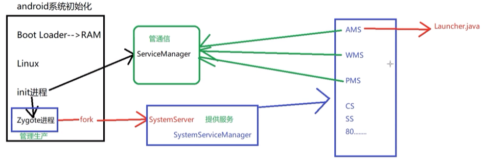

1. 当车机上电后，会有一个引导芯片来加载引导程序--Boot Loader
2. Boot Loader程序会把Linux操作系统拉起来。
3. Linux内核会开启一个init进程，init进程会加载init.rc文件，根据init.rc文件的内容来进行设置和拉起一些服务。在init.rc文件中定义了大量的需要开启的关键性服务。
  这里面的服务分两类，一类是硬件层的，像电话功能、网络功能、摄像头等。
4. 在init过程中有两个比较重要的进程，ServiceManager和Zygote进程。
   **ServiceManager**: 管理整个应用层的通信问题。
   **Zygote**：管理进程的生产问题。Zygote进程会fork一个SystemServer的服务，用于管理所有的服务。这写服务之间的通信的binder接口，都会到ServiceManager进程中去注册，以后需要使用服务就可以使用binder接口。