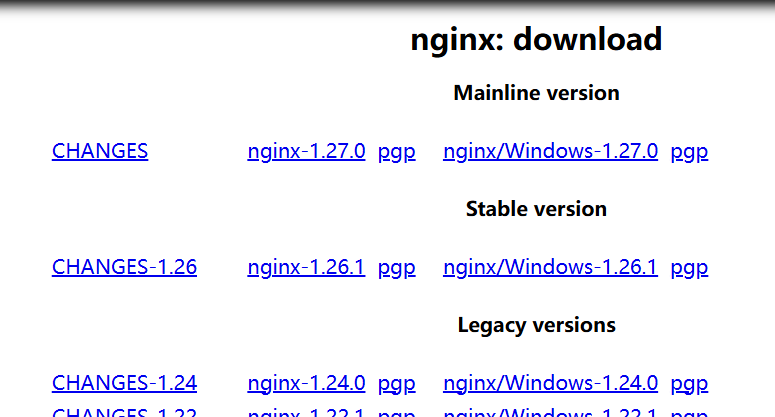

[toc]

# 1 nginx介绍
Nginx 是一个高性能的 HTTP 和反向代理服务器，也可以用作邮件代理服务器和通用的 TCP/UDP 代理服务器。它由俄罗斯程序员 Igor Sysoev 开发，并于 2004 年首次发布。以下是 Nginx 的一些主要特性和用途：

1. **高性能**：Nginx 以其高性能和低资源消耗而闻名，特别适合处理大量的并发连接。
2. **反向代理**：Nginx 可以作为反向代理服务器，分发来自客户端的请求到多个后端服务器，以实现负载均衡和提高性能。
3. **负载均衡**：Nginx 提供多种负载均衡算法（如轮询、最少连接等），帮助分配流量，提升系统的整体性能和可靠性。
4. **静态文件处理**：Nginx 在处理静态文件（如 HTML、CSS、JavaScript、图片等）时表现出色，效率高。
5. **缓存功能**：Nginx 支持 HTTP 缓存，可以显著提高动态内容的访问速度，减轻后端服务器的负载。
6. **安全性**：Nginx 提供多种安全功能，包括限制连接速率、IP 黑白名单、SSL/TLS 支持等。
7. **可扩展性**：Nginx 具有良好的可扩展性，通过第三方模块可以实现各种功能扩展。

Nginx 常用于以下场景：
- 作为 Web 服务器，提供高性能的静态内容服务。
- 作为反向代理服务器，分发请求到后端的应用服务器。
- 作为负载均衡器，分配流量，提高系统的可用性和性能。
- 作为 API 网关，处理 API 请求和响应。
- 作为邮件代理服务器，处理邮件协议（IMAP、POP3、SMTP）相关的请求。
- 静态资源虚拟化

总体来说，Nginx 是一个功能强大、灵活性高的服务器软件，广泛应用于各种互联网应用和服务中。


# 2 正向代理
- 客户端请求目标服务器之间的一个代理服务器

- 请求会先经过代理服务器，然后再转发请求到目标服务器，获得内容后最后响应给客户端


# 3 反向代理
用户请求目标服务器，由代理服务器决定访问哪个ip.

如下例子，教务处负责把不同学生分配到不同的班级，就相当于是一个反向代理服务器


## 3.1 反向代理之路由
对于不同的域名，nginx服务器把它们的请求分配到不同是服务器


# 4 nginx安装
## 4.1 下载安装包
在https://nginx.org/en/download.html瞎子对应版本的nginx安装包

- **Mainline version**: 正在开发的版本
- **Stable version**: 稳定版本
- **Legacy versions**: 历史版本

## 4.2 linux环境按章nginx
1. 参考 [4.1 下载安装包](#41-下载安装包)获取nginx安装包
2. 安装依赖环境
- 安装gcc环境
- 安装PCRE库。用于解析正则表达式 `sudo apt install libpcre3 libpcre3-dev`
- 安装zlib压缩和解压缩依赖 `sudo apt install zlib1g zlib1g-dev`
- ssl依赖, 用于https的安全传输。 `sudo apt install libssl-dev openssl`

3.解压第一步的安装包
```
tar -zxvf nginx-1.26.1.tar.gz
```

4. 编译之前，先创建nginx临时目录，如果不创建，在启动nginx过程中会报错
```shell
mkdir /var/temp/nginx -p
```

5. 在nginx目录下执行以下命令，创建makefile文件
```shell
./configure \
--prefix=/usr/local/nginx \
--pid-path=/var/run/nginx/nginx.pid \
--lock-path=/var/lock/nginx.lock \
--error-log-path=/var/log/nginx/error.log \
--http-log-path=/var/log/nginx/access.log \
--with-http_gzip_static_module \
--http-client-body-temp-path=/var/temp/nginx/client \
--http-proxy-temp-path=/var/temp/nginx/proxy \
--http-fastcgi-temp-path=/var/temp/nginx/fastcgi \
--http-uwsgi-temp-path=/var/temp/nginx/uwsgi \
--http-scgi-temp-path=/var/temp/nginx/scgi
```

配置：
|配置项|说明|
|------|----|
|--prefix|指定nginx安装目录|
|--pid-path|指向nginx的pid|
|--lock-path|锁定安装文件，防止被恶意篡改或误操作|
|--error-log-path|错误日志存放路径|
|--http-log-path|http日志存放路径|
|--with-http_gzip_static_module|启动gzip模块，在线实时压缩输出数据流|
|--http-client-body-temp-path|设定客户端请求的临时目录|
|--http-proxy-temp-path|设置http代理临时目录|
|--http-fastcgi-temp-path|设定fastcgi临时目录|
|--http-uwsgi-temp-path|设定uwsgi临时目录|
|--http-scgi-temp-path|设定scgi临时目录|

6. make编译
```shell
make
```

7. 安装
```shell
make install
```

8. 进入/usr/local/nginx/sbin目录启动nginx
```shell
./nginx
```

9. 进入浏览器，访问虚拟机所处内网ip即可打开ngin默认页面 `127.0.0.1:80`

10. 停止nginx `./nginx -s stop`
11. 重新加载nginx `./nginx -s reload`


## 4.3 docker运行nginx
```dockerfile
version: '3'

services:
  nginx:
    image: nginx:latest
    container_name: nginx_server
    ports:
      - "80:80"
      - "1678:1678"
    volumes:
      - ./nginx.conf:/etc/nginx/nginx.conf:ro
      - ./html:/usr/share/nginx/html:ro
      - ./logs:/var/log/nginx
      - ./certs:/etc/nginx/certs:ro
    restart: always
```
